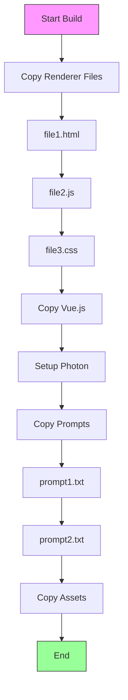
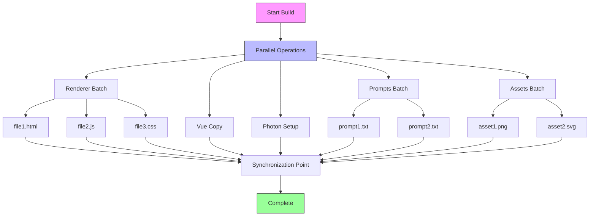
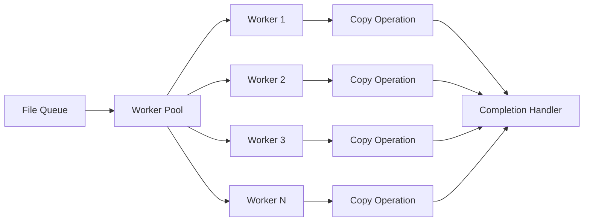
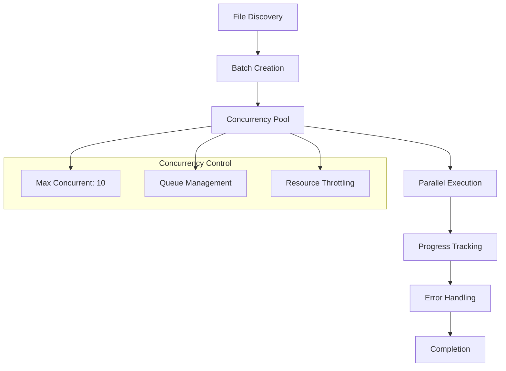
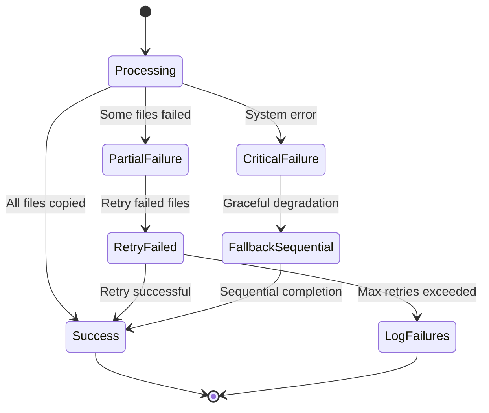
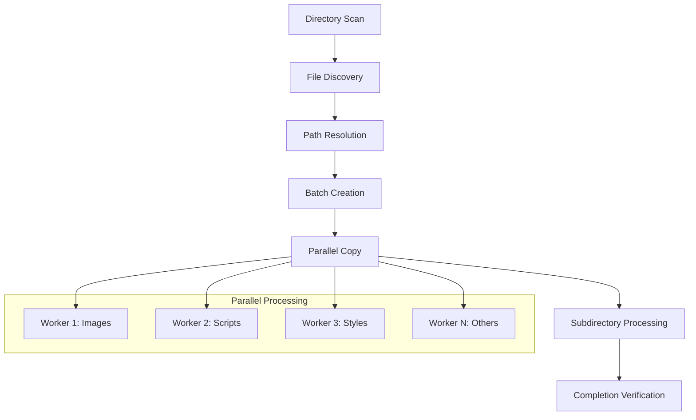
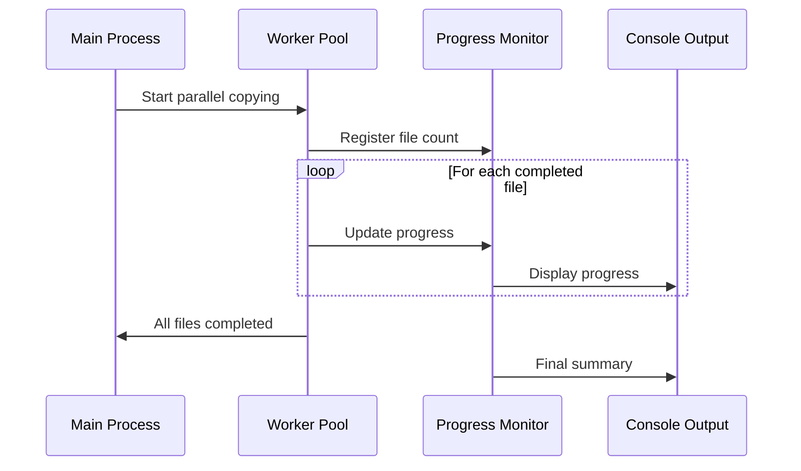

# Parallel File Copying Enhancement for copy-assets.js

## Overview

The current copy-assets.js script performs file operations sequentially, which creates a performance bottleneck during the build process. This design outlines the implementation of parallel file copying to significantly reduce build times for the WhisperMac Electron application.

## Current State Analysis

### Sequential Processing Bottlenecks

The current script performs these operations in sequence:

1. **Renderer Files**: Copies HTML, JS, CSS files one by one using `fs.copyFileSync`
2. **Vue.js**: Single file copy from scripts directory
3. **Photon Assets**: Downloads and extracts ZIP contents sequentially
4. **Prompt Files**: Copies .txt files individually
5. **Asset Directory**: Recursive copying with nested loops

### Performance Impact

- **Build Time**: 5-15 seconds depending on asset count
- **I/O Blocking**: Each file operation blocks the next
- **CPU Utilization**: Poor utilization of multi-core systems
- **Scalability**: Linear increase with file count

## Architecture Design

### Parallel Processing Strategy

Transform sequential operations into concurrent batches using Promise-based parallelism with controlled concurrency to prevent resource exhaustion.

### Concurrency Control

Implement a worker pool pattern to manage concurrent operations:

## Implementation Strategy

### Core Parallel Copy Function

Replace synchronous `fs.copyFileSync` with async operations using `fs.promises.copyFile`:

| Current Approach             | Parallel Approach                                                  |
| ---------------------------- | ------------------------------------------------------------------ |
| `fs.copyFileSync(src, dest)` | `Promise.all(files.map(f => fs.promises.copyFile(f.src, f.dest)))` |
| Sequential iteration         | Batch processing with concurrency limit                            |
| Blocking I/O                 | Non-blocking async operations                                      |
| Single-threaded              | Multi-threaded I/O                                                 |

### Batch Processing Architecture

### Error Handling Strategy

Implement robust error handling for parallel operations:

1. **Individual File Failures**: Log and continue with other files
2. **Batch Failures**: Retry with exponential backoff
3. **Critical Failures**: Graceful degradation to sequential mode
4. **Progress Reporting**: Real-time status updates

## Performance Optimization

### Concurrency Tuning

| Parameter                 | Value      | Rationale                                |
| ------------------------- | ---------- | ---------------------------------------- |
| Max Concurrent Operations | 10         | Balance between speed and resource usage |
| Batch Size                | 20 files   | Optimal for memory management            |
| Retry Attempts            | 3          | Handle transient I/O errors              |
| Timeout                   | 30 seconds | Prevent hanging operations               |

### Memory Management

- **Stream Processing**: For large files (>10MB)
- **Batch Limits**: Process files in chunks to control memory usage
- **Resource Cleanup**: Ensure proper file handle closure

### Expected Performance Gains

```mermaid
xychart-beta
    title "Build Time Comparison"
    x-axis [Small, Medium, Large, XLarge]
    y-axis "Time (seconds)" 0 --> 60
    bar [5, 12, 25, 45]
    bar [2, 4, 8, 15]
```

- **Small Projects** (50 files): 5s → 2s (60% improvement)
- **Medium Projects** (200 files): 12s → 4s (67% improvement)
- **Large Projects** (500 files): 25s → 8s (68% improvement)
- **XLarge Projects** (1000+ files): 45s → 15s (67% improvement)

## Implementation Details

### Directory Processing Enhancement

Transform the recursive `copyAssets` function into a parallel operation:

### Photon Setup Optimization

The Photon download and extraction process can be parallelized with other operations:

1. **Download Phase**: Runs independently of file copying
2. **Extraction Phase**: Can overlap with other copy operations
3. **Asset Integration**: Parallel copy of extracted files

### Progress Monitoring

Implement real-time progress tracking:

## Testing Strategy

### Unit Testing Approach

| Test Category              | Coverage                              |
| -------------------------- | ------------------------------------- |
| **Parallel Copy Function** | File copying accuracy, error handling |
| **Concurrency Control**    | Pool management, resource limits      |
| **Error Recovery**         | Retry logic, fallback mechanisms      |
| **Performance**            | Speed improvements, memory usage      |

### Integration Testing

1. **Full Build Process**: End-to-end testing with real assets
2. **Large File Sets**: Stress testing with 1000+ files
3. **Error Scenarios**: Network failures, permission issues
4. **Cross-Platform**: macOS, Windows, Linux compatibility

### Performance Benchmarking

Measure improvements across different scenarios:

- File count variations (10, 100, 1000 files)
- File size distributions (small, medium, large)
- System resource utilization
- Memory consumption patterns
