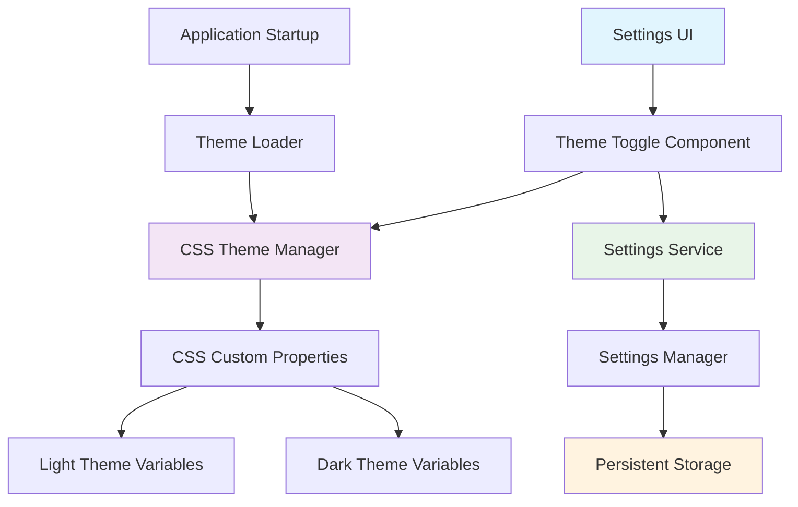
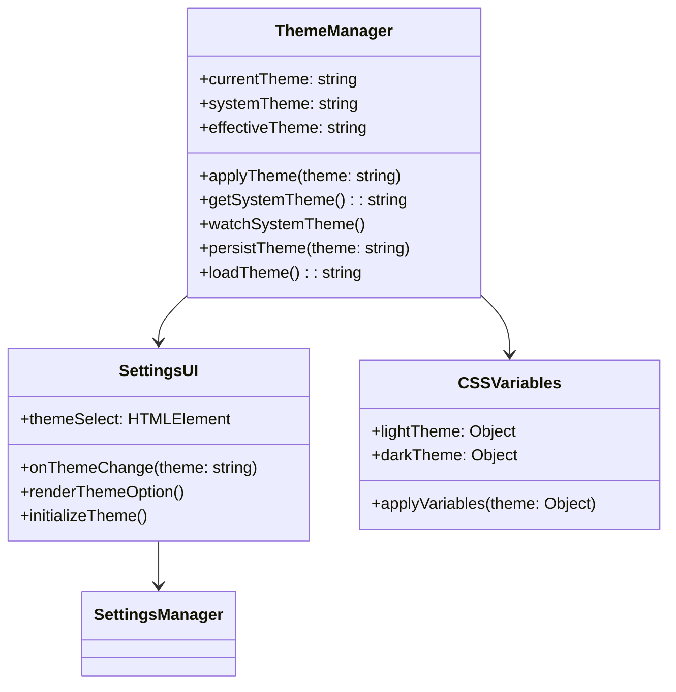
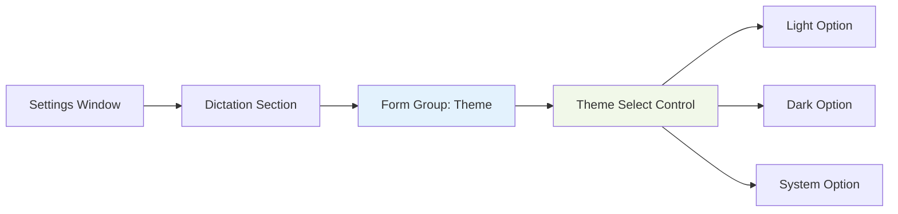
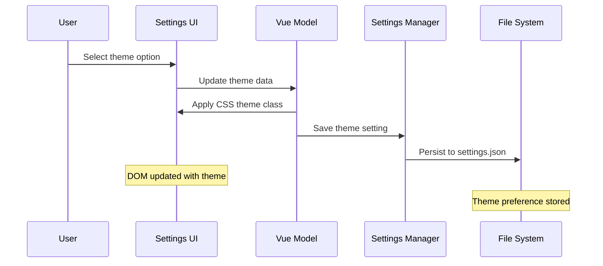
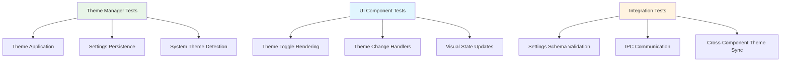
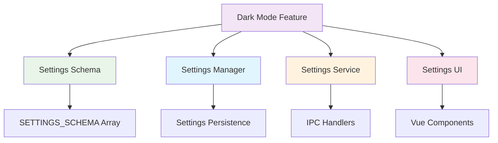

# Dark Mode Implementation Design

## Overview

This design outlines the implementation of a dark mode feature for the WhisperMac settings interface. The solution provides users with a visual theme toggle that persists across sessions and integrates seamlessly with the existing settings architecture.

**Core Requirements:**
- Toggle between light and dark visual themes
- Persist theme preference across application sessions
- Apply consistently across all settings UI components
- Maintain visual accessibility and design consistency
- Integrate with existing settings schema and management system

## Technology Stack & Dependencies

**Frontend:**
- Vue.js 3 (existing reactive framework)
- CSS custom properties for theming
- HTML/CSS for settings interface

**Backend:**
- TypeScript settings management system
- Electron IPC for settings persistence
- JSON-based settings storage

**Integration Points:**
- SettingsSchema.ts for configuration definition
- SettingsManager.ts for persistence
- settingsWindow.html/js for UI implementation

## Component Architecture

### Theme System Architecture



### Settings Schema Integration

The dark mode setting will be integrated into the existing settings schema as a new field in the "dictation" section:

| Property | Value |
|----------|--------|
| **Key** | `ui.theme` |
| **Type** | `select` |
| **Label** | "Interface Theme" |
| **Description** | "Choose between light and dark interface themes" |
| **Default** | `"light"` |
| **Options** | `[{value: "light", label: "Light"}, {value: "dark", label: "Dark"}, {value: "system", label: "Follow System"}]` |

### Component Definition

#### Theme Toggle Component



#### Component Hierarchy



## Styling Strategy

### CSS Custom Properties System

The implementation leverages CSS custom properties (CSS variables) defined in the existing `:root` selector. The current light theme variables will be reorganized into a structured theming system.

#### Light Theme Variables
```css
:root {
  --color-bg-primary: #ffffff;
  --color-bg-secondary: #f8f8f8;
  --color-bg-tertiary: #f0f0f0;
  --color-bg-sidebar: #f5f5f5;
  
  --color-text-primary: #333333;
  --color-text-secondary: #666666;
  --color-text-tertiary: #999999;
  
  --color-border-primary: #e0e0e0;
  --color-border-secondary: #d0d0d0;
}
```

#### Dark Theme Variables
```css
[data-theme="dark"] {
  --color-bg-primary: #1a1a1a;
  --color-bg-secondary: #2d2d2d;
  --color-bg-tertiary: #3a3a3a;
  --color-bg-sidebar: #252525;
  
  --color-text-primary: #ffffff;
  --color-text-secondary: #cccccc;
  --color-text-tertiary: #999999;
  
  --color-border-primary: #404040;
  --color-border-secondary: #505050;
}
```

### Theme Application Strategy

| Component | Light Theme | Dark Theme | Implementation |
|-----------|-------------|------------|----------------|
| **Background** | `#ffffff` | `#1a1a1a` | CSS custom property |
| **Text** | `#333333` | `#ffffff` | CSS custom property |
| **Borders** | `#e0e0e0` | `#404040` | CSS custom property |
| **Sidebar** | `#f5f5f5` | `#252525` | CSS custom property |
| **Form Controls** | Light variants | Dark variants | CSS custom property |

## State Management

### Theme State Flow



### Vue.js Integration

The theme management will integrate with the existing Vue.js data model:

```javascript
data() {
  return {
    // Existing data properties...
    currentTheme: 'light',
    systemThemeSupported: true
  }
},
methods: {
  onThemeChange(newTheme) {
    this.currentTheme = newTheme;
    this.applyTheme(newTheme);
    this.saveSettings();
  },
  
  applyTheme(theme) {
    const effectiveTheme = theme === 'system' 
      ? this.getSystemTheme() 
      : theme;
    document.documentElement.setAttribute('data-theme', effectiveTheme);
  }
}
```

## API Integration Layer

### Settings Service Extensions

The existing SettingsService will be extended to handle theme-related operations without requiring significant architectural changes.

#### IPC Method Extensions

| Method | Purpose | Parameters | Return |
|--------|---------|------------|--------|
| `getTheme()` | Retrieve current theme | None | `string` |
| `setTheme(theme)` | Apply theme setting | `theme: string` | `void` |
| `getSystemTheme()` | Get OS theme preference | None | `string` |

### Settings Manager Integration

The theme setting will be integrated into the existing settings persistence mechanism:

```typescript
// Extended settings interface
interface AppSettings {
  // Existing settings...
  'ui.theme': 'light' | 'dark' | 'system';
}

// Settings schema addition
{
  key: 'ui.theme',
  type: 'select',
  label: 'Interface Theme',
  description: 'Choose between light and dark interface themes',
  defaultValue: 'light',
  options: [
    { value: 'light', label: 'Light' },
    { value: 'dark', label: 'Dark' },
    { value: 'system', label: 'Follow System' }
  ]
}
```

## User Interface Implementation

### Form Control Design

The theme selector will be implemented as a standard settings form group following the existing design patterns:

```html
<div class="form-group">
  <label for="ui-theme">
    <i class="ph-duotone ph-palette"></i>
    Interface Theme
  </label>
  <div class="field-description">
    Choose between light and dark interface themes
  </div>
  <select id="ui-theme" class="form-control" v-model="settings['ui.theme']" @change="onThemeChange">
    <option value="light">Light</option>
    <option value="dark">Dark</option>
    <option value="system">Follow System</option>
  </select>
</div>
```

### Visual Design Specifications

#### Theme Toggle Styling
- **Position**: Dictation section, after existing window controls
- **Icon**: Phosphor "palette" icon (`ph-palette`)
- **Layout**: Standard form group with label, description, and select control
- **Interaction**: Immediate theme application on selection change

#### Dark Theme Color Specifications

| Element | Color | Contrast Ratio |
|---------|--------|----------------|
| Primary Background | `#1a1a1a` | - |
| Secondary Background | `#2d2d2d` | - |
| Primary Text | `#ffffff` | 12.6:1 |
| Secondary Text | `#cccccc` | 9.5:1 |
| Border | `#404040` | - |
| Accent (Primary) | `#007aff` | 4.5:1 |

### Accessibility Considerations

- Maintain WCAG 2.1 AA contrast ratios in both themes
- Preserve semantic meaning of colors across themes
- Ensure focus indicators remain visible in dark theme
- Test with screen readers for consistent experience

## Testing Strategy

### Unit Testing



### Test Cases

| Test Category | Test Case | Expected Result |
|---------------|-----------|-----------------|
| **Theme Application** | Apply light theme | All CSS variables updated to light values |
| **Theme Application** | Apply dark theme | All CSS variables updated to dark values |
| **Theme Application** | Apply system theme | Theme matches OS preference |
| **Persistence** | Save theme setting | Theme persisted in settings.json |
| **Persistence** | Load saved theme | Theme applied on application startup |
| **UI Integration** | Change theme selector | Immediate visual update |
| **System Integration** | OS theme change | Auto-update when using system theme |

### Manual Testing Checklist

- [ ] Theme toggle responds immediately
- [ ] Theme preference persists across app restarts
- [ ] All UI components update consistently
- [ ] System theme detection works correctly
- [ ] Contrast ratios meet accessibility standards
- [ ] Focus indicators visible in both themes
- [ ] Form controls maintain usability in dark theme

## Architecture Integration

### Existing System Integration Points

The dark mode implementation integrates with several existing architectural components:



### Configuration Flow

1. **Schema Registration**: Theme setting added to `SETTINGS_SCHEMA`
2. **Default Values**: Light theme set as default in schema
3. **UI Rendering**: Settings UI auto-generates theme control from schema
4. **Value Binding**: Vue.js two-way binding connects UI to settings model
5. **Persistence**: SettingsManager automatically saves theme preference
6. **Application**: Theme CSS applied immediately on change

### Minimal System Changes

The implementation leverages existing infrastructure to minimize architectural impact:

- **No new services**: Uses existing SettingsService and SettingsManager
- **No new IPC channels**: Uses existing settings save/load mechanisms  
- **No new dependencies**: Pure CSS and vanilla JavaScript for theme logic
- **Schema-driven**: UI automatically generated from settings schema
- **Event-driven**: Integrates with existing settings update events