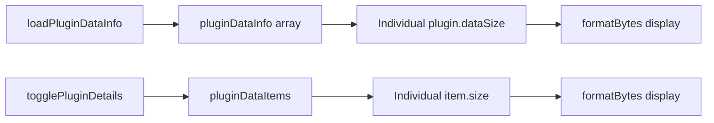
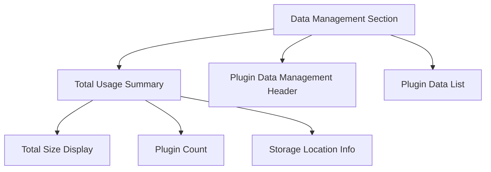

# Data Management Display Enhancement

## Overview

This design addresses two UI improvements for the WhisperMac settings window data management section:

1. Remove gray background from plugin data detail items
2. Add a total data usage display at the top of the data management section

## Current State Analysis

### Existing Data Management Structure

- Plugin data items have gray background from `.plugin-data-item` CSS class using `background: var(--color-bg-secondary)`
- Individual data items have hover effect with `background: var(--color-bg-secondary)` on `.plugin-data-item-detail:hover`
- Data is displayed per-plugin with individual size information
- No aggregate total data usage display exists

### Data Flow



## Design Changes

### 1. Remove Gray Backgrounds

#### CSS Modifications

Remove or modify the following CSS rules in `settingsWindow.html`:

**Current problematic styles:**

- `.plugin-data-item { background: var(--color-bg-secondary); }`
- `.plugin-data-item-detail:hover { background: var(--color-bg-secondary); }`

**Proposed changes:**

- Set transparent background for plugin data items
- Remove hover background effect on detail items
- Maintain border and shadow effects for visual hierarchy

### 2. Total Data Usage Display

#### UI Component Structure



#### Component Specifications

**Total Usage Summary Component:**

- Position: Top of data management section, before "Plugin Data Management" header
- Content:
  - Total data size across all plugins
  - Number of plugins with data
  - Clear visual distinction from individual plugin items

**Layout Structure:**

```
┌─────────────────────────────────────────┐
│ Total Data Usage Summary                │
│ ├─ 📊 Total: 2.4 GB                    │
│ ├─ 📁 5 plugins with data              │
│ └─ 📍 Storage: /path/to/data           │
└─────────────────────────────────────────┘
```

### 3. Implementation Details

#### Vue.js Data Structure

```javascript
computed: {
  totalDataUsage() {
    return this.pluginDataInfo.reduce((total, plugin) => {
      return total + (plugin.dataSize || 0);
    }, 0);
  },

  pluginCountWithData() {
    return this.pluginDataInfo.filter(plugin =>
      plugin.dataSize > 0
    ).length;
  }
}
```

#### HTML Template Addition

```html
<!-- Total Data Usage Summary -->
<div class="total-data-usage-summary">
  <div class="usage-stats">
    <div class="usage-item">
      <i class="ph-duotone ph-chart-pie"></i>
      <span class="usage-label">Total Usage:</span>
      <span class="usage-value">{{ formatBytes(totalDataUsage) }}</span>
    </div>
    <div class="usage-item">
      <i class="ph-duotone ph-folder-simple"></i>
      <span class="usage-label">Plugins with Data:</span>
      <span class="usage-value">{{ pluginCountWithData }}</span>
    </div>
  </div>
</div>
```

#### CSS Styling

```css
.total-data-usage-summary {
  background: linear-gradient(
    135deg,
    rgba(0, 122, 255, 0.08),
    rgba(0, 122, 255, 0.03)
  );
  border: 1px solid var(--color-border-primary);
  border-radius: var(--radius-lg);
  padding: var(--spacing-lg);
  margin-bottom: var(--spacing-lg);
}

.usage-stats {
  display: flex;
  gap: var(--spacing-xl);
  flex-wrap: wrap;
}

.usage-item {
  display: flex;
  align-items: center;
  gap: var(--spacing-sm);
}

.usage-label {
  color: var(--color-text-secondary);
  font-size: var(--font-size-sm);
}

.usage-value {
  color: var(--color-text-primary);
  font-weight: var(--font-weight-semibold);
  font-size: var(--font-size-md);
}

/* Remove gray backgrounds */
.plugin-data-item {
  background: transparent;
  border: 1px solid var(--color-border-primary);
}

.plugin-data-item-detail:hover {
  background: rgba(0, 122, 255, 0.05);
}
```

### 4. User Experience Improvements

#### Visual Hierarchy

- Total usage summary draws attention without overwhelming detail sections
- Cleaner appearance with removed gray backgrounds
- Consistent hover states using brand color instead of gray

#### Information Architecture

- Quick overview at top level (total usage)
- Detailed breakdown remains available per plugin
- Progressive disclosure maintained for data items

#### Accessibility

- Clear contrast ratios maintained
- Semantic HTML structure preserved
- Icon usage for visual enhancement without dependency

## Technical Considerations

### Performance Impact

- Minimal: Adding computed properties for totals
- No additional API calls required
- Leverages existing `pluginDataInfo` data structure

### Responsive Design

- Summary layout adapts to available width
- Usage items wrap on smaller screens
- Maintains mobile compatibility

### Browser Compatibility

- Uses existing CSS custom properties
- Compatible with Electron's Chromium engine
- No modern web API dependencies

## Testing Strategy

### Visual Testing

- Verify gray backgrounds removed from data items
- Confirm total usage display appears correctly
- Test hover states maintain visibility

### Functional Testing

- Validate total calculations accuracy
- Ensure real-time updates when data changes
- Test with various plugin configurations (0 data, multiple plugins, large sizes)

### Edge Cases

- Empty plugin data state
- Single plugin with data
- Very large data sizes (TB range)
- Plugin data loading states
