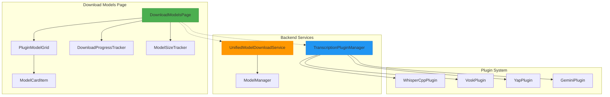
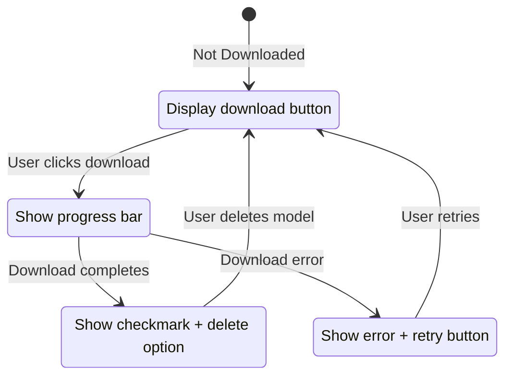
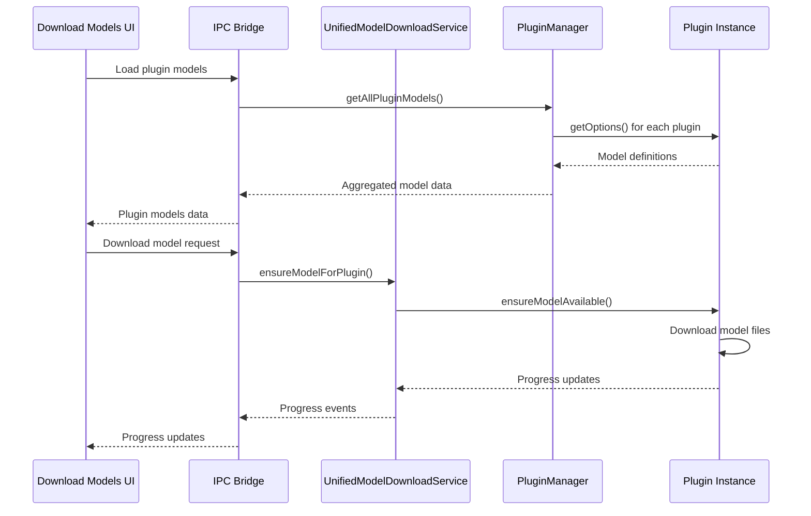
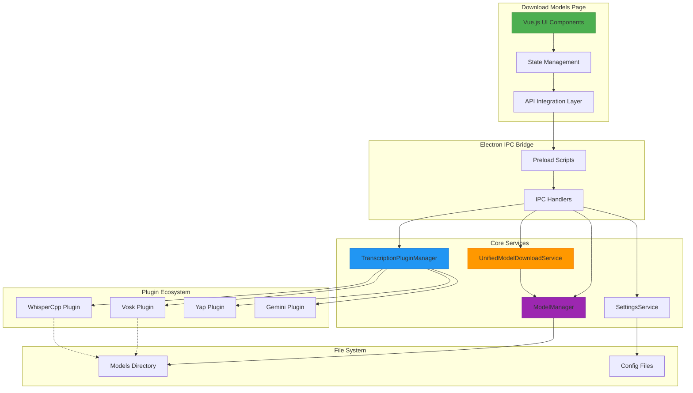

# Download Models Page Design

## Overview

This document outlines the design for a unified download models page that allows users to browse, download, and manage transcription models across all available plugins. The page will integrate seamlessly with the existing plugin system while maintaining design cohesion with the current settings interface.

**Key Design Principles:**
- Leverage existing plugin infrastructure without modification
- Maintain visual consistency with current settings UI
- Provide unified model management across all transcription engines
- Enable bulk downloads and progress tracking
- Support model validation and cleanup

## Technology Stack & Dependencies

- **Framework**: Vanilla JavaScript with Vue.js 3 (consistent with existing settings page)
- **UI Library**: Photon CSS framework (existing design system)
- **Icons**: Phosphor Icons (consistent with current implementation)
- **Backend Integration**: Electron IPC via existing preload scripts
- **Plugin System**: TranscriptionPluginManager and UnifiedModelDownloadService

## Component Architecture

### Core Components



### Component Hierarchy

```
DownloadModelsPage (Root)
├── ModelSizeTracker (Header Component)
├── PluginModelGrid (Main Content)
│   ├── PluginModelSection (Per Plugin)
│   │   ├── PluginHeader
│   │   └── ModelCardGrid
│   │       └── ModelCardItem[] (Models)
└── DownloadProgressTracker (Bottom Component)
```

### Component Definition

#### DownloadModelsPage
**Purpose**: Root component managing the entire download models interface

**Props/State Management**:
- `availablePlugins`: Array of plugin instances with model information
- `downloadQueue`: Active downloads with progress tracking
- `modelStorage`: Current model storage usage by plugin
- `filterOptions`: Model filtering by type, size, language

**Lifecycle Methods/Hooks**:
- `onMounted`: Initialize plugin data and storage tracking
- `onUnmounted`: Clean up download progress listeners

#### PluginModelSection
**Purpose**: Displays models available for a specific transcription plugin

**Props**:
- `plugin`: Plugin instance with metadata
- `models`: Array of available models for the plugin
- `downloadedModels`: Currently downloaded models

**State**:
- `expandedView`: Whether model details are expanded
- `downloadingModels`: Models currently downloading

#### ModelCardItem
**Purpose**: Individual model card with download/management controls

**Props**:
- `model`: Model metadata (name, size, description)
- `plugin`: Associated plugin
- `isDownloaded`: Whether model exists locally
- `downloadProgress`: Current download progress (0-100)

**Events**:
- `@download`: Triggered when download button clicked
- `@delete`: Triggered when delete button clicked
- `@cancel`: Triggered when download cancellation requested

### Example Component Usage

```html
<!-- Plugin Model Section -->
<div class="plugin-section" v-for="plugin in availablePlugins" :key="plugin.name">
  <PluginHeader 
    :plugin="plugin" 
    :total-models="plugin.models.length"
    :downloaded-count="getDownloadedCount(plugin)"
    @toggle-expand="togglePlugin(plugin.name)"
  />
  
  <ModelCardGrid v-if="plugin.expanded" class="model-grid">
    <ModelCardItem
      v-for="model in plugin.models"
      :key="`${plugin.name}-${model.value}`"
      :model="model"
      :plugin="plugin"
      :is-downloaded="isModelDownloaded(plugin.name, model.value)"
      :download-progress="getDownloadProgress(plugin.name, model.value)"
      @download="downloadModel(plugin.name, model.value)"
      @delete="deleteModel(plugin.name, model.value)"
    />
  </ModelCardGrid>
</div>
```

## Routing & Navigation

The download models page will be accessed via the existing settings navigation sidebar as a new menu item:

**Navigation Structure**:
```
Settings Window
├── General
├── Transcription Engines  
├── AI Enhancement
├── Keyboard Shortcuts
├── Voice Commands
├── Data Management
└── Download Models (NEW)
```

**Route Integration**:
- Add "Download Models" to `nav-group-item` list in settingsWindow.html
- Implement view switching using existing `showView()` function
- Maintain URL fragment routing consistency (`#download-models`)

## Styling Strategy

### Design System Integration

The page will extend the existing CSS design system defined in settingsWindow.html:

**Color Palette**:
- Primary: `var(--color-primary)` (#007aff)
- Success: `var(--color-success)` (#34c759) - for downloaded models
- Warning: `var(--color-warning)` (#ff9500) - for downloading
- Error: `var(--color-error)` (#ff3b30) - for failed downloads

**Layout Components**:
```css
.download-models-container {
  padding: var(--spacing-lg);
  display: flex;
  flex-direction: column;
  gap: var(--spacing-lg);
}

.plugin-section {
  background: var(--color-bg-secondary);
  border-radius: var(--radius-lg);
  border: 1px solid var(--color-border-primary);
  overflow: hidden;
}

.model-card {
  background: var(--color-bg-primary);
  border: 1px solid var(--color-border-primary);
  border-radius: var(--radius-md);
  padding: var(--spacing-md);
  transition: var(--transition-normal);
}

.model-card:hover {
  border-color: var(--color-border-focus);
  box-shadow: var(--shadow-md);
}
```

### Model Card Visual States



## State Management

### Vue 3 Composition API Structure

```typescript
interface DownloadModelsState {
  plugins: PluginWithModels[];
  downloads: DownloadProgress[];
  storage: StorageInfo;
  filters: FilterOptions;
  loading: boolean;
  error: string | null;
}

interface PluginWithModels {
  name: string;
  displayName: string;
  description: string;
  models: ModelOption[];
  expanded: boolean;
  available: boolean;
}

interface DownloadProgress {
  pluginName: string;
  modelName: string;
  status: 'downloading' | 'complete' | 'error' | 'cancelled';
  progress: number;
  message: string;
}

interface StorageInfo {
  totalUsed: number;
  byPlugin: Record<string, number>;
  available: number;
}
```

### State Mutations

**Download Management**:
- `startDownload(plugin, model)`: Initiate model download
- `updateProgress(plugin, model, progress)`: Update download progress
- `completeDownload(plugin, model)`: Mark download as complete
- `cancelDownload(plugin, model)`: Cancel ongoing download

**Storage Tracking**:
- `updateStorageInfo()`: Refresh storage usage information
- `deleteModel(plugin, model)`: Remove model and update storage

**Plugin Management**:
- `togglePluginExpansion(plugin)`: Expand/collapse plugin section
- `refreshPluginData()`: Reload plugin model information

## API Integration Layer

### IPC Communication Channels

**New IPC Handlers** (to be added to existing system):

```typescript
// In main process IpcHandlerManager
ipcMain.handle('models:getPluginModels', async () => {
  return transcriptionPluginManager.getAllPluginModels();
});

ipcMain.handle('models:downloadModel', async (event, pluginName, modelName) => {
  return unifiedModelDownloadService.ensureModelForPlugin(
    pluginName, 
    modelName, 
    (progress) => event.sender.send('models:downloadProgress', progress)
  );
});

ipcMain.handle('models:getStorageInfo', async () => {
  return transcriptionPluginManager.getAllPluginDataInfo();
});

ipcMain.handle('models:deleteModel', async (event, pluginName, modelId) => {
  const plugin = transcriptionPluginManager.getPlugin(pluginName);
  return plugin?.deleteDataItem(modelId);
});
```

**Preload Script Extensions** (extend settingsPreload.ts):

```typescript
// Add to existing contextBridge.exposeInMainWorld
models: {
  getPluginModels: () => ipcRenderer.invoke('models:getPluginModels'),
  downloadModel: (plugin, model) => ipcRenderer.invoke('models:downloadModel', plugin, model),
  getStorageInfo: () => ipcRenderer.invoke('models:getStorageInfo'),
  deleteModel: (plugin, modelId) => ipcRenderer.invoke('models:deleteModel', plugin, modelId),
  onDownloadProgress: (callback) => 
    ipcRenderer.on('models:downloadProgress', (_, progress) => callback(progress))
}
```

### Data Flow Architecture



## Testing Strategy

### Unit Testing Approach

**Component Tests** (Jest + Vue Test Utils):
```typescript
describe('ModelCardItem', () => {
  it('should display download button for unavailable models', () => {
    const wrapper = mount(ModelCardItem, {
      props: {
        model: mockWhisperModel,
        plugin: mockPlugin,
        isDownloaded: false
      }
    });
    expect(wrapper.find('.download-button')).toBeTruthy();
  });

  it('should show progress bar during download', () => {
    const wrapper = mount(ModelCardItem, {
      props: {
        downloadProgress: 45
      }
    });
    expect(wrapper.find('.progress-bar')).toBeTruthy();
    expect(wrapper.text()).toContain('45%');
  });
});
```

**Integration Tests**:
- Plugin model loading from actual plugin instances
- Download progress tracking across multiple models
- Storage calculation accuracy
- Error handling for failed downloads

**E2E Testing** (Electron Spectron):
```typescript
describe('Download Models Page', () => {
  it('should load all available plugins and models', async () => {
    await app.client.click('[data-nav="download-models"]');
    await app.client.waitForExist('.plugin-section');
    
    const pluginSections = await app.client.$$('.plugin-section');
    expect(pluginSections.length).toBeGreaterThan(0);
  });

  it('should download and track model progress', async () => {
    await app.client.click('.model-card .download-button');
    await app.client.waitForExist('.progress-bar');
    // Verify progress updates and completion
  });
});
```

## Architecture Integration Points

### Plugin System Integration

**Leverage Existing Infrastructure**:
1. **TranscriptionPluginManager**: Use existing `getPlugin()` and plugin iteration methods
2. **Plugin.getOptions()**: Extract model-select options for display
3. **UnifiedModelDownloadService**: Utilize existing download orchestration
4. **Plugin.ensureModelAvailable()**: Leverage plugin-specific download logic

**No Plugin Modifications Required**:
- Models are discovered via existing `getOptions()` method
- Downloads use existing `ensureModelAvailable()` interface
- Storage tracking uses existing `getDataSize()` and `listData()` methods

### Settings Service Integration

**Configuration Management**:
```typescript
// Extend existing SettingsService without modification
interface DownloadModelsSettings {
  autoDownloadRecommended: boolean;
  downloadLocation: string;
  maxConcurrentDownloads: number;
  showAdvancedModels: boolean;
}

// Access via existing settings infrastructure
const settings = await window.electronAPI.getSettings();
const downloadSettings = settings.downloadModels || {};
```

### Model Manager Integration

**Storage and Cleanup**:
- Utilize existing `ModelManager.getModelPath()` for file location
- Leverage `ModelManager.ensureModelExists()` for download validation  
- Use existing cleanup methods for model deletion

**Progress Tracking**:
- Extend existing `ModelDownloadProgress` interface
- Maintain compatibility with current progress reporting

## Data Models & Schema

### Plugin Model Discovery

```typescript
interface DiscoveredPluginModel {
  pluginName: string;
  pluginDisplayName: string;
  model: {
    value: string;           // Model identifier
    label: string;           // Display name
    description: string;     // Model description
    size?: string;          // Estimated download size
    language?: string[];    // Supported languages
    category?: string;      // Model category (basic/advanced)
  };
  isDownloaded: boolean;
  downloadPath?: string;
  lastUpdated?: Date;
}
```

### Storage Information Schema

```typescript
interface ModelStorageInfo {
  plugin: string;
  models: Array<{
    id: string;
    name: string;
    size: number;
    downloadDate: Date;
    path: string;
  }>;
  totalSize: number;
  availableSpace: number;
}
```

### Download Queue Schema

```typescript
interface DownloadQueueItem {
  id: string;
  pluginName: string;
  modelName: string;
  status: 'queued' | 'downloading' | 'completed' | 'failed' | 'cancelled';
  progress: number;
  startTime?: Date;
  completionTime?: Date;
  error?: string;
  estimatedTimeRemaining?: number;
}
```

## Business Logic Layer

### Model Discovery Engine

**Plugin Model Enumeration**:
```typescript
class ModelDiscoveryService {
  async discoverAllModels(): Promise<DiscoveredPluginModel[]> {
    const plugins = transcriptionPluginManager.getAllPlugins();
    const discoveredModels: DiscoveredPluginModel[] = [];
    
    for (const plugin of plugins) {
      const options = plugin.getOptions();
      const modelOptions = options.filter(opt => opt.type === 'model-select');
      
      for (const modelOption of modelOptions) {
        for (const model of modelOption.options || []) {
          discoveredModels.push({
            pluginName: plugin.name,
            pluginDisplayName: plugin.displayName,
            model: model,
            isDownloaded: await this.checkModelExists(plugin.name, model.value)
          });
        }
      }
    }
    
    return discoveredModels;
  }
}
```

### Download Orchestration

**Queue Management**:
```typescript
class DownloadQueueManager {
  private maxConcurrent = 2;
  private activeDownloads = new Map<string, DownloadQueueItem>();
  private pendingQueue: DownloadQueueItem[] = [];
  
  async enqueueDownload(pluginName: string, modelName: string): Promise<string> {
    const downloadId = `${pluginName}-${modelName}-${Date.now()}`;
    const queueItem: DownloadQueueItem = {
      id: downloadId,
      pluginName,
      modelName,
      status: 'queued',
      progress: 0
    };
    
    this.pendingQueue.push(queueItem);
    this.processQueue();
    
    return downloadId;
  }
  
  private async processQueue(): Promise<void> {
    while (this.activeDownloads.size < this.maxConcurrent && this.pendingQueue.length > 0) {
      const item = this.pendingQueue.shift()!;
      this.activeDownloads.set(item.id, item);
      this.startDownload(item);
    }
  }
}
```

### Storage Analytics

**Space Tracking**:
```typescript
class ModelStorageAnalytics {
  async calculateTotalUsage(): Promise<StorageInfo> {
    const plugins = transcriptionPluginManager.getAllPlugins();
    let totalUsed = 0;
    const byPlugin: Record<string, number> = {};
    
    for (const plugin of plugins) {
      const size = await plugin.getDataSize();
      byPlugin[plugin.name] = size;
      totalUsed += size;
    }
    
    return {
      totalUsed,
      byPlugin,
      available: await this.getAvailableSpace()
    };
  }
}
```

## Architecture Diagram



This design provides a comprehensive solution for model management that leverages the existing plugin architecture while maintaining design consistency and providing an intuitive user experience for downloading and managing transcription models across all available plugins.