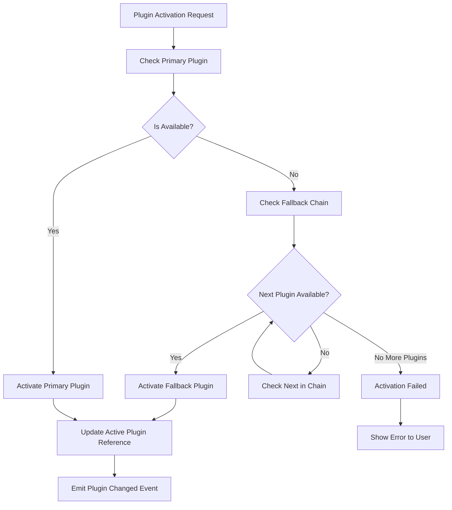
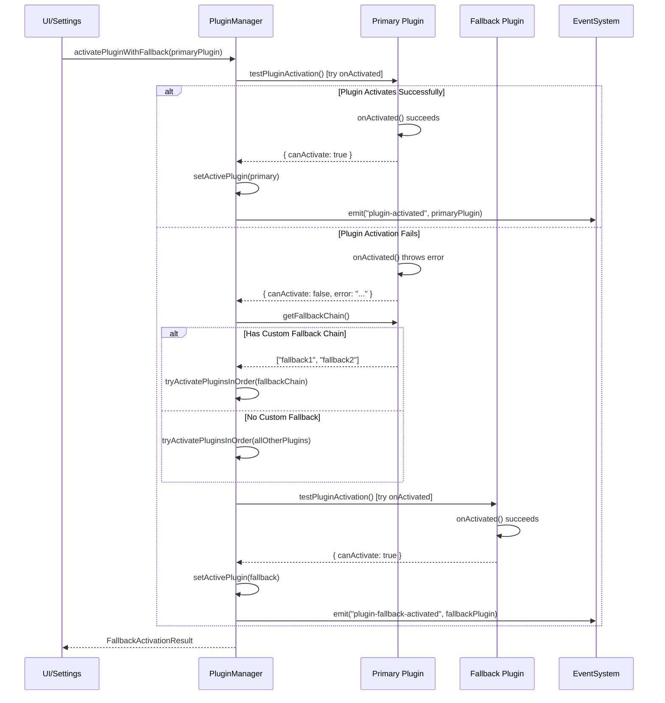
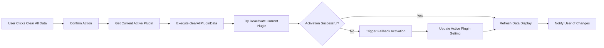
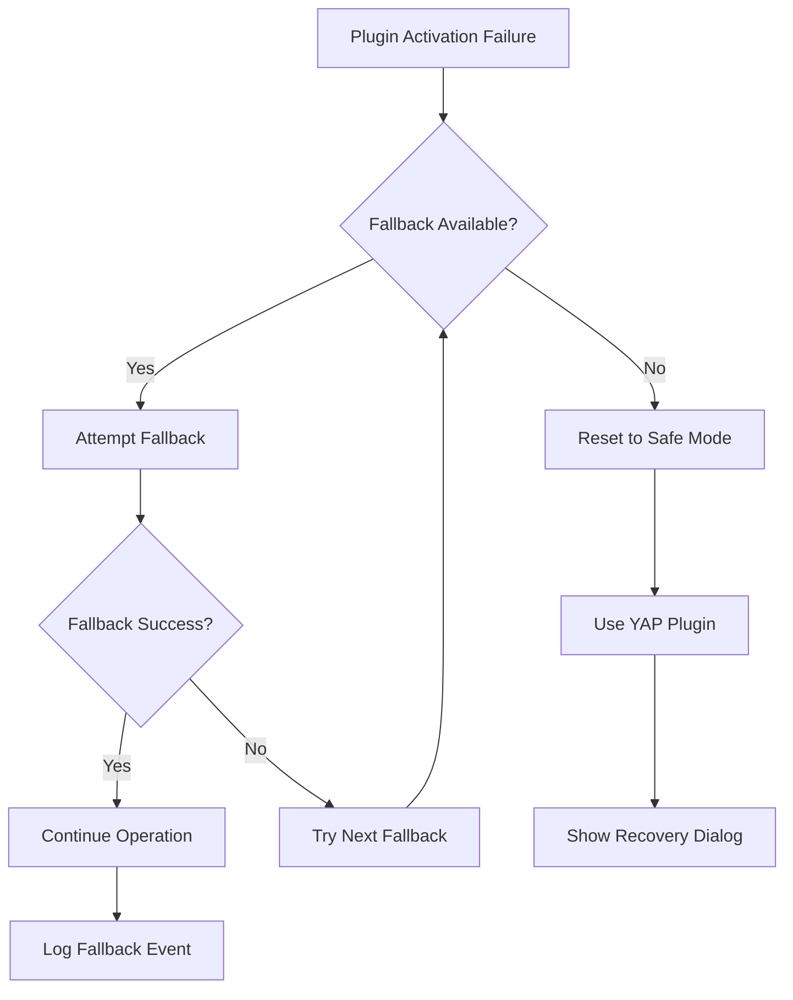

# Plugin Fallback Activation System Design

## Overview

This design describes a fallback activation system for WhisperMac transcription plugins that automatically switches to alternative plugins when the active plugin fails to activate due to missing data, configuration issues, or other failures. The system ensures continuous service availability by maintaining a fallback chain and automatically refreshing data displays after data clearing operations.

## Architecture

### Current Plugin System Analysis

The existing system uses `TranscriptionPluginManager` to manage plugin lifecycle:

- Plugin registration and initialization
- Single active plugin pattern
- Manual plugin switching via settings
- Plugin availability checking via `isAvailable()` method
- Data management with `deleteAllData()` operations

### Proposed Fallback System



## Plugin Fallback Chain Management

### Plugin-Specific Fallback Configuration

Each plugin can optionally define its own fallback chain by overriding the `getFallbackChain()` method. If no custom fallback is specified, the system will try all other available plugins in any order until one successfully activates.

```typescript
// Example: WhisperCppTranscriptionPlugin.ts
class WhisperCppTranscriptionPlugin extends BaseTranscriptionPlugin {
  // ... existing methods ...

  getFallbackChain(): string[] {
    // Custom fallback preference: try Vosk first, then YAP
    return ["vosk", "yap"];
  }
}

// Example: VoskTranscriptionPlugin.ts
class VoskTranscriptionPlugin extends BaseTranscriptionPlugin {
  // ... existing methods ...

  getFallbackChain(): string[] {
    // Custom fallback preference: try Whisper.cpp first, then YAP
    return ["whisper-cpp", "yap"];
  }
}

// Example: YapTranscriptionPlugin.ts
class YapTranscriptionPlugin extends BaseTranscriptionPlugin {
  // ... existing methods ...

  getFallbackChain(): string[] {
    // YAP is typically the last resort, no fallbacks
    return [];
  }
}
```

### Activation Without Model Downloads

Critical requirement: Plugin activation during fallback testing **must not** trigger model downloads. The `testPluginActivation()` method uses the existing `onActivated()` call which already handles this properly.

```typescript
// Example: WhisperCppTranscriptionPlugin onActivated implementation
async onActivated(uiFunctions?: PluginUIFunctions): Promise<void> {
  this.setActive(true);

  try {
    // Check if model exists - this validates without downloading
    const modelName = this.options.model || "ggml-base.en.bin";
    const modelPath = this.resolveModelPath();

    if (!existsSync(modelPath)) {
      const error = `Model ${modelName} not found. Please download it first.`;
      this.setError(error);
      throw new Error(error); // This will be caught by testPluginActivation
    }

    // Other activation logic...
    this.setError(null);
    console.log(`Plugin activated with model: ${modelName}`);
  } catch (error) {
    this.setActive(false);
    throw error; // Propagate to fallback system
  }
}
```

### Integration with Existing System

The fallback system leverages the existing plugin activation infrastructure:

- Uses `plugin.isAvailable()` for lightweight initial checks
- Uses `plugin.onActivated()` for full activation testing
- Integrates with existing `setActivePlugin()` method
- Preserves existing error handling and state management
- No duplication of validation logic

### Enhanced setActivePlugin Implementation

```typescript
// Enhanced TranscriptionPluginManager.setActivePlugin method
async setActivePlugin(
  name: string,
  options: Record<string, any> = {},
  uiFunctions?: PluginUIFunctions,
): Promise<void> {
  const plugin = this.getPlugin(name);
  if (!plugin) {
    throw new Error(`Plugin ${name} not found`);
  }

  // Existing validation logic...
  const state = plugin.getState();
  if (state.isLoading && state.downloadProgress?.status === "downloading") {
    throw new Error(`Cannot activate ${name}: currently downloading`);
  }

  // Deactivate current plugin if different
  if (this.activePlugin && this.activePlugin !== plugin) {
    try {
      await this.activePlugin.stopTranscription();
      await this.activePlugin.onDeactivate();
    } catch (error) {
      console.error("Error deactivating current plugin:", error);
    }
  }

  // Activate new plugin - this is where errors are thrown for fallback
  this.activePlugin = plugin;

  try {
    // Update options
    if (Object.keys(options).length > 0) {
      await plugin.updateOptions(options, uiFunctions);
    }

    // Activate the plugin - errors here trigger fallback
    await plugin.onActivated(uiFunctions);

    // Success - emit events
    this.emit("active-plugin-changed", plugin);
    console.log(`Active transcription plugin set to: ${plugin.displayName}`);
  } catch (error) {
    this.activePlugin = null;
    throw new Error(`Failed to activate plugin ${name}: ${error}`);
  }
}
```

## Enhanced TranscriptionPluginManager

### New Methods

```typescript
class TranscriptionPluginManager {
  // Existing methods...

  /**
   * Attempt to activate plugin with fallback support
   * If no specific fallback chain is defined, try all other plugins
   */
  async activatePluginWithFallback(
    primaryPluginName?: string,
    options: Record<string, any> = {},
    uiFunctions?: PluginUIFunctions
  ): Promise<FallbackActivationResult>;

  /**
   * Get fallback chain for a given plugin (from plugin itself)
   */
  getFallbackChain(primaryPlugin: string): string[];

  /**
   * Test plugin activation using existing onActivated() call
   */
  async testPluginActivation(
    pluginName: string,
    options?: Record<string, any>
  ): Promise<{
    canActivate: boolean;
    error?: string;
  }>;

  /**
   * Try activating plugins in order until one succeeds
   * Uses the existing setActivePlugin logic with proper error handling
   */
  private async tryActivatePluginsInOrder(
    pluginNames: string[],
    options: Record<string, any>,
    uiFunctions?: PluginUIFunctions
  ): Promise<{
    success: boolean;
    activePlugin: string | null;
    errors: Record<string, string>;
  }>;
}
```

### Fallback Activation Algorithm



## UI Integration Plan

### Integration Points

The fallback activation system integrates into the UI at two main points:

1. **App Launch**: Attempt to activate the stored plugin setting with fallback
2. **Data Clearing**: Trigger fallback when "Clear All Data" is executed

### App Launch Integration

#### Current App Launch Flow

Based on the existing codebase, the app launch follows this pattern:

1. `main.ts` → `InitializationManager.initialize()`
2. Plugin manager initialization via `initializePlugins()`
3. Plugin activation via `setActivePlugin()`

#### Enhanced Launch Flow with Fallback

```typescript
// Enhanced InitializationManager.ts
class InitializationManager {
  private async initializePlugins(): Promise<void> {
    this.appStateManager.setSetupStatus("initializing-plugins");
    try {
      await this.transcriptionPluginManager.initializePlugins();

      // NEW: Use fallback activation instead of direct setActivePlugin
      const storedPlugin =
        this.settingsService.getCurrentSettings()?.transcriptionPlugin;

      const fallbackResult =
        await this.transcriptionPluginManager.activatePluginWithFallback(
          storedPlugin,
          {}, // Use stored options from config
          undefined // No UI functions during launch
        );

      if (fallbackResult.success) {
        // Update stored setting if plugin changed due to fallback
        if (fallbackResult.activePlugin !== storedPlugin) {
          this.settingsService
            .getSettingsManager()
            .set("transcriptionPlugin", fallbackResult.activePlugin);
          this.settingsService.getSettingsManager().saveSettings();

          console.log(
            `Plugin fallback during launch: ${storedPlugin} → ${fallbackResult.activePlugin}`
          );

          // Show notification to user if app has UI ready
          this.showPluginFallbackNotification(
            storedPlugin,
            fallbackResult.activePlugin
          );
        }

        console.log("Transcription plugins initialized with fallback support");
      } else {
        // All plugins failed - use ErrorManager
        throw new Error(
          `No transcription plugins could be activated. Errors: ${JSON.stringify(
            fallbackResult.errors
          )}`
        );
      }
    } catch (error) {
      console.error("Failed to initialize transcription plugins:", error);
      // Show error notification
      this.errorManager.showError({
        title: "Plugin Initialization Failed",
        description:
          "No transcription plugins could be activated. Please check your configuration.",
        actions: ["ok"],
      });
    }
    this.appStateManager.setSetupStatus("service-ready");
  }

  private showPluginFallbackNotification(
    originalPlugin: string,
    activePlugin: string,
    errors: Record<string, string>
  ): void {
    // Only show if we have a window available (not during silent startup)
    if (this.windowManager.hasVisibleWindows()) {
      const failureReason = errors[originalPlugin] || "Unknown error";

      this.errorManager.showError({
        title: "Plugin Switched",
        description: `Could not activate ${originalPlugin} plugin (${failureReason}). Switched to ${activePlugin} plugin instead.`,
        actions: ["ok", "settings"],
      });
    }
  }
}
```

### Data Clearing Integration

#### Enhanced Settings Window (settingsWindow.js)

```javascript
// Enhanced clearAllPluginData method
async clearAllPluginData() {
  // Enhanced confirmation dialog with fallback explanation
  if (!confirm(
    "This will delete ALL data from ALL plugins.\n\n" +
    "This includes:\n" +
    "• Downloaded models and temporary files\n" +
    "• Secure storage data (API keys, settings)\n" +
    "• All plugin-specific data\n\n" +
    "If the current plugin can't reactivate after clearing, " +
    "the system will automatically switch to an available fallback plugin.\n\n" +
    "This action cannot be undone. Continue?"
  )) {
    return;
  }

  this.isClearingAll = true;
  const originalPlugin = this.activePlugin;

  try {
    this.showProgress("Clearing all plugin data...", 0);

    // Call the enhanced backend method with fallback support
    const result = await window.electronAPI.clearAllPluginDataWithFallback();

    if (result.success) {
      // Handle plugin change notification
      if (result.pluginChanged) {
        this.activePlugin = result.newActivePlugin;

        // Show prominent notification about plugin change
        this.showPluginChangeNotification(
          originalPlugin,
          result.newActivePlugin,
          result.failedPlugins
        );
      } else {
        this.showStatus("All plugin data cleared successfully", "success");
      }

      // Refresh data display with updated info
      this.pluginDataInfo = result.updatedDataInfo || [];
      this.pluginDataItems = {};
      this.expandedDataPlugins = {};

      // Update the active plugin dropdown in UI
      this.updateActivePluginDisplay();

    } else {
      throw new Error(result.error || "Failed to clear plugin data");
    }
  } catch (error) {
    console.error("Failed to clear all plugin data:", error);
    this.showStatus(`Failed to clear plugin data: ${error.message}`, "error");
  } finally {
    this.isClearingAll = false;
    this.hideProgress();
  }
},

// New method to show plugin change notification
showPluginChangeNotification(originalPlugin, newPlugin, failedPlugins) {
  const failedList = failedPlugins.length > 0
    ? ` (Failed: ${failedPlugins.join(", ")})`
    : "";

  // Show a more prominent warning-style notification
  this.showStatus(
    `Plugin switched: ${originalPlugin} → ${newPlugin}${failedList}`,
    "warning",
    8000 // Show for 8 seconds
  );

  // Also show in console for debugging
  console.warn(`Plugin fallback occurred during data clearing:`, {
    original: originalPlugin,
    new: newPlugin,
    failed: failedPlugins
  });
},

// New method to update UI elements after plugin change
updateActivePluginDisplay() {
  // Update the plugin selection dropdown
  const pluginSelect = document.querySelector('select[data-setting="transcriptionPlugin"]');
  if (pluginSelect) {
    pluginSelect.value = this.activePlugin;
    // Trigger change event to update any dependent UI
    pluginSelect.dispatchEvent(new Event('change'));
  }

  // Update any other UI elements that display the active plugin
  this.refreshPluginStatus();
},

// Enhanced status display with longer duration for warnings
showStatus(message, type = "success", duration = 3000) {
  this.status = { visible: true, message, type };
  setTimeout(() => {
    this.status.visible = false;
  }, duration);
}
```

### Backend IPC Integration

#### Enhanced SettingsService.ts

```typescript
// New IPC handler for data clearing with fallback
ipcMain.handle("settings:clearAllPluginDataWithFallback", async () => {
  try {
    const currentActivePlugin =
      this.transcriptionPluginManager?.getActivePluginName();

    console.log(
      `Starting data clearing with fallback for active plugin: ${currentActivePlugin}`
    );

    // Clear all plugin data
    await this.transcriptionPluginManager?.clearAllPluginData();

    // Attempt fallback activation with the original plugin first
    const fallbackResult =
      await this.transcriptionPluginManager?.activatePluginWithFallback(
        currentActivePlugin || "yap",
        {}, // Use stored plugin options
        {
          // Provide UI functions for backend feedback
          showProgress: (message: string, percent: number) => {
            // Send progress to renderer
            this.settingsWindow?.webContents.send("settings:clearProgress", {
              message,
              percent,
            });
          },
          showError: (error: string) => {
            console.error("Plugin activation error during fallback:", error);
          },
          showSuccess: (message: string) => {
            console.log("Plugin activation success:", message);
          },
        }
      );

    // Update configuration if plugin changed
    if (
      fallbackResult?.success &&
      fallbackResult.activePlugin !== currentActivePlugin
    ) {
      this.settingsManager.set(
        "transcriptionPlugin",
        fallbackResult.activePlugin
      );
      this.settingsManager.saveSettings();

      console.log(
        `Plugin changed due to fallback: ${currentActivePlugin} → ${fallbackResult.activePlugin}`
      );
    }

    // Get updated plugin data info
    const updatedPluginDataInfo =
      await this.transcriptionPluginManager?.getPluginDataInfo();

    return {
      success: true,
      pluginChanged: fallbackResult?.activePlugin !== currentActivePlugin,
      newActivePlugin: fallbackResult?.activePlugin,
      failedPlugins: fallbackResult?.failedPlugins || [],
      errors: fallbackResult?.errors || {},
      updatedDataInfo: updatedPluginDataInfo || [],
    };
  } catch (error: any) {
    console.error("Error during data clearing with fallback:", error);
    return {
      success: false,
      error: error.message || "Unknown error during data clearing",
    };
  }
});

// Add progress listener for clearing operations
ipcMain.handle("settings:onClearProgress", (event, callback) => {
  // Set up listener for clear progress events
  this.settingsWindow?.webContents.on("settings:clearProgress", callback);
});
```

### Visual Feedback Enhancements

#### Settings Window HTML Updates

```html
<!-- Enhanced status display with warning styling -->
<div v-if="status.visible" :class="`status-message status-${status.type}`">
  <div class="status-content">
    <i :class="getStatusIcon(status.type)"></i>
    <span>{{ status.message }}</span>
  </div>
  <button @click="status.visible = false" class="status-close">&times;</button>
</div>

<!-- Enhanced plugin selection with fallback indicator -->
<div class="plugin-selection-container">
  <select v-model="activePlugin" @change="handlePluginChange">
    <option
      v-for="plugin in pluginData.plugins"
      :key="plugin.name"
      :value="plugin.name"
    >
      {{ plugin.displayName }}
    </option>
  </select>
  <div
    v-if="pluginWasSwitched"
    class="fallback-indicator"
    title="Plugin was automatically switched due to activation failure"
  >
    <i class="ph-duotone ph-warning"></i>
    <span>Fallback Active</span>
  </div>
</div>
```

#### CSS Styling for Fallback Indicators

```css
/* Warning status styling */
.status-message.status-warning {
  background: #fff3cd;
  border: 1px solid #ffeaa7;
  color: #856404;
}

.status-message.status-warning i {
  color: #f39c12;
}

/* Fallback indicator styling */
.fallback-indicator {
  display: flex;
  align-items: center;
  gap: 4px;
  padding: 4px 8px;
  background: #fff3cd;
  border: 1px solid #ffeaa7;
  border-radius: 4px;
  font-size: 12px;
  color: #856404;
  margin-left: 8px;
}

.fallback-indicator i {
  font-size: 14px;
  color: #f39c12;
}

/* Enhanced progress display */
.progress-container.clearing {
  background: linear-gradient(45deg, #f8f9fa, #e9ecef);
  border: 2px solid #dee2e6;
}

.progress-container.clearing .progress-message {
  font-weight: 600;
  color: #495057;
}
```

### Error Handling and User Communication

#### Notification Strategy

1. **Silent Fallback (App Launch)**:

   - Log to console
   - Update settings silently
   - Show notification only if UI is available
   - Store fallback event for settings display

2. **Interactive Fallback (Data Clearing)**:

   - Show progress during clearing
   - Display plugin change notification
   - Update UI immediately
   - Provide detailed feedback

3. **Fallback Failure**:
   - Show error dialog with recovery options
   - Suggest manual plugin selection
   - Offer to open plugin settings

#### User Guidance

```javascript
// Method to provide user guidance on plugin issues
showPluginGuidance(failedPlugins, errors) {
  const guidanceMessages = {
    'whisper-cpp': 'Try downloading a Whisper model in the Models section',
    'vosk': 'Try downloading a Vosk model in the Models section',
    'gemini': 'Check your Gemini API key in the AI settings',
    'yap': 'YAP plugin should always work - this may indicate a system issue'
  };

  let guidance = "Plugin activation issues detected:\n\n";
  failedPlugins.forEach(plugin => {
    const error = errors[plugin] || 'Unknown error';
    const suggestion = guidanceMessages[plugin] || 'Check plugin configuration';
    guidance += `• ${plugin}: ${error}\n  Suggestion: ${suggestion}\n\n`;
  });

  if (confirm(guidance + "Would you like to open the settings to fix these issues?")) {
    // Navigate to appropriate settings section
    this.showSection('transcription');
  }
}
```

### Enhanced Data Management

When `clearAllPluginData()` is executed:

1. **Pre-Clearing Validation**

   - Identify active plugin
   - Check if active plugin requires cleared data
   - Prepare fallback activation plan

2. **Data Clearing Process**

   - Execute existing `clearAllPluginData()` method
   - Track which plugins were affected

3. **Post-Clearing Recovery**
   - Attempt to reactivate current plugin
   - If fails, trigger fallback activation
   - Update UI with new active plugin

### Data Clearing Flow



## Settings Window Integration

### Enhanced Settings Service

```typescript
// New IPC handler for data clearing with fallback
ipcMain.handle("settings:clearAllPluginDataWithFallback", async () => {
  try {
    const currentActivePlugin =
      transcriptionPluginManager.getActivePluginName();

    // Clear all plugin data
    await transcriptionPluginManager.clearAllPluginData();

    // Attempt fallback activation
    const fallbackResult =
      await transcriptionPluginManager.activatePluginWithFallback(
        currentActivePlugin
      );

    // Update configuration if plugin changed
    if (
      fallbackResult.success &&
      fallbackResult.activePlugin !== currentActivePlugin
    ) {
      settingsManager.set("transcriptionPlugin", fallbackResult.activePlugin);
      settingsManager.saveSettings();
    }

    // Get updated plugin data info
    const updatedPluginDataInfo =
      await transcriptionPluginManager.getPluginDataInfo();

    return {
      success: true,
      pluginChanged: fallbackResult.activePlugin !== currentActivePlugin,
      newActivePlugin: fallbackResult.activePlugin,
      failedPlugins: fallbackResult.failedPlugins,
      updatedDataInfo: updatedPluginDataInfo,
    };
  } catch (error) {
    return { success: false, error: error.message };
  }
});
```

### UI Enhancements

**Settings Window JavaScript Updates:**

```javascript
async clearAllPluginData() {
  // Enhanced confirmation dialog
  if (!confirm(
    "This will delete ALL data from ALL plugins.\n\n" +
    "If the current plugin can't reactivate, the system will " +
    "automatically switch to an available fallback plugin.\n\n" +
    "Continue?"
  )) {
    return;
  }

  this.isClearingAll = true;
  try {
    this.showProgress("Clearing all plugin data...", 0);

    // Use new enhanced clearing method
    const result = await window.electronAPI.clearAllPluginDataWithFallback();

    if (result.success) {
      // Handle plugin change notification
      if (result.pluginChanged) {
        this.activePlugin = result.newActivePlugin;
        this.showStatus(
          `Data cleared. Switched to ${result.newActivePlugin} plugin.`,
          "warning"
        );
      } else {
        this.showStatus("All plugin data cleared successfully", "success");
      }

      // Refresh data display with updated info
      this.pluginDataInfo = result.updatedDataInfo;
      this.pluginDataItems = {};
      this.expandedDataPlugins = {};

    } else {
      throw new Error(result.error || "Failed to clear plugin data");
    }
  } catch (error) {
    console.error("Failed to clear all plugin data:", error);
    this.showStatus(`Failed to clear plugin data: ${error.message}`, "error");
  } finally {
    this.isClearingAll = false;
    this.hideProgress();
  }
}
```

## Plugin Validation Framework

### Simplified Plugin Activation Testing

The system uses try-catch on the existing `onActivated()` call to determine if a plugin can successfully activate. No retries, no hardcoded fallbacks - just clean activation testing.

```typescript
interface FallbackActivationResult {
  success: boolean;
  activePlugin: string | null;
  failedPlugins: string[];
  errors: Record<string, string>;
}

// Enhanced TranscriptionPluginManager methods
class TranscriptionPluginManager {
  /**
   * Test if a plugin can activate by trying onActivated()
   * Single attempt only - no retries
   */
  async testPluginActivation(
    pluginName: string,
    options: Record<string, any> = {},
    uiFunctions?: PluginUIFunctions
  ): Promise<{ canActivate: boolean; error?: string }> {
    const plugin = this.getPlugin(pluginName);
    if (!plugin) {
      return { canActivate: false, error: `Plugin ${pluginName} not found` };
    }

    // Check basic availability first (lightweight check)
    const isAvailable = await plugin.isAvailable();
    if (!isAvailable) {
      return { canActivate: false, error: "Plugin not available" };
    }

    // Test actual activation by calling onActivated - single attempt only
    try {
      // Set options if provided
      if (Object.keys(options).length > 0) {
        await plugin.updateOptions(options, uiFunctions);
      }

      // Try to activate - this is where the real validation happens
      await plugin.onActivated(uiFunctions);

      // If we get here, activation succeeded
      return { canActivate: true };
    } catch (error: any) {
      // Activation failed - capture the error, no retry
      return {
        canActivate: false,
        error: error.message || "Plugin activation failed",
      };
    }
  }

  /**
   * Attempt to activate plugin with fallback support
   * Try each plugin exactly once until one succeeds
   */
  async activatePluginWithFallback(
    primaryPluginName?: string,
    options: Record<string, any> = {},
    uiFunctions?: PluginUIFunctions
  ): Promise<FallbackActivationResult> {
    const failedPlugins: string[] = [];
    const errors: Record<string, string> = {};

    // Get all available plugins
    const allPlugins = this.getPlugins().map((p) => p.name);

    // Create activation order: primary first, then others
    const activationOrder = primaryPluginName
      ? [
          primaryPluginName,
          ...allPlugins.filter((name) => name !== primaryPluginName),
        ]
      : allPlugins;

    // Try each plugin exactly once
    for (const pluginName of activationOrder) {
      const result = await this.testPluginActivation(
        pluginName,
        options,
        uiFunctions
      );

      if (result.canActivate) {
        // Success - activate this plugin using existing setActivePlugin
        try {
          await this.setActivePlugin(pluginName, options, uiFunctions);
          return {
            success: true,
            activePlugin: pluginName,
            failedPlugins,
            errors,
          };
        } catch (error: any) {
          // This shouldn't happen since testPluginActivation passed, but handle it
          failedPlugins.push(pluginName);
          errors[pluginName] = error.message || "Activation failed";
        }
      } else {
        // Failed - record and continue
        failedPlugins.push(pluginName);
        errors[pluginName] = result.error || "Unknown error";
      }
    }

    // All plugins failed
    return {
      success: false,
      activePlugin: null,
      failedPlugins,
      errors,
    };
  }
}
```

```typescript
interface FallbackActivationResult {
  success: boolean;
  activePlugin: string | null;
  failedPlugins: string[];
  errors: Record<string, string>;
}

// Enhanced TranscriptionPluginManager methods
class TranscriptionPluginManager {
  /**
   * Test if a plugin can activate by trying onActivated()
   * Uses existing activation logic without duplicating validation
   */
  async testPluginActivation(
    pluginName: string,
    options: Record<string, any> = {},
    uiFunctions?: PluginUIFunctions
  ): Promise<{ canActivate: boolean; error?: string }> {
    const plugin = this.getPlugin(pluginName);
    if (!plugin) {
      return { canActivate: false, error: `Plugin ${pluginName} not found` };
    }

    // Check basic availability first (lightweight check)
    const isAvailable = await plugin.isAvailable();
    if (!isAvailable) {
      return { canActivate: false, error: "Plugin not available" };
    }

    // Test actual activation by calling onActivated
    try {
      // Set options if provided
      if (Object.keys(options).length > 0) {
        await plugin.updateOptions(options, uiFunctions);
      }

      // Try to activate - this is where the real validation happens
      await plugin.onActivated(uiFunctions);

      // If we get here, activation succeeded
      return { canActivate: true };
    } catch (error: any) {
      // Activation failed - capture the error
      return {
        canActivate: false,
        error: error.message || "Plugin activation failed",
      };
    }
  }
}
```

## Configuration Integration

### No Additional Configuration Required

The fallback system is enabled by default and requires no additional configuration. The system simply:

- Uses existing plugin settings from the configuration
- Automatically tries available plugins when activation fails
- Updates the stored plugin setting when fallback occurs
- No user-configurable options needed

## Error Handling and Recovery

### Fallback Failure Scenarios

1. **No Available Plugins**: Show error dialog with instructions
2. **Partial Activation**: Plugin starts but fails during operation
3. **Configuration Corruption**: Reset to safe defaults

### Error Recovery Strategy



## Event System Integration

### New Events

```typescript
// Plugin manager events
transcriptionPluginManager.on("plugin-fallback-activated", (data) => {
  console.log(`Fallback activated: ${data.originalPlugin} → ${data.newPlugin}`);
});

transcriptionPluginManager.on("plugin-activation-failed", (data) => {
  console.log(
    `Plugin activation failed: ${data.plugin}, reason: ${data.reason}`
  );
});

transcriptionPluginManager.on("fallback-chain-exhausted", (data) => {
  console.log(`All fallback options exhausted for ${data.originalPlugin}`);
});
```

## Testing Strategy

### Unit Testing

1. **Plugin Validation Testing**

   - Mock plugin availability states
   - Test validation logic for each plugin type
   - Test data dependency checking

2. **Fallback Logic Testing**

   - Test fallback chain traversal
   - Test activation failure handling
   - Test configuration persistence

3. **Data Clearing Integration Testing**
   - Test plugin reactivation after data clearing
   - Test fallback activation scenarios
   - Test UI state consistency

### Integration Testing

1. **End-to-End Data Clearing Flow**

   - Clear all data → verify fallback activation
   - Test UI refresh and notification system
   - Verify settings persistence

2. **Plugin Failure Simulation**
   - Simulate missing model files
   - Simulate corrupted plugin data
   - Test recovery mechanisms

## Implementation Plan

### Phase 1: Core Fallback System

- Implement `activatePluginWithFallback` method in TranscriptionPluginManager
- Add `testPluginActivation` method using try-catch on existing `onActivated()` calls
- Update BaseTranscriptionPlugin with optional `getFallbackChain()` method
- Single attempt per plugin - no retries

### Phase 2: App Launch Integration

- Modify `InitializationManager.initializePlugins()` to use fallback activation
- Use ErrorManager for complete activation failure scenarios
- Update settings persistence when fallback occurs during startup
- Remove hardcoded plugin references

### Phase 3: Data Clearing Integration

- Create new `clearAllPluginDataWithFallback` IPC handler
- Update settings window JavaScript with simplified fallback handling
- Remove hardcoded plugin guidance
- Implement automatic data display refresh and plugin selection updates

### Phase 4: UI Simplification

- Use ErrorManager for all error scenarios
- Simple status messages for plugin changes
- Remove configuration options (enabled by default)
- Clean up hardcoded references and guidance

### Phase 5: Testing and Validation

- Test app launch fallback scenarios
- Test data clearing with automatic plugin switching
- Verify ErrorManager integration works correctly
- Ensure no retries or infinite loops occur
- Test that first available plugin activates successfully
