# Rules Editor Design

## Overview

The rules editor is a compact and user-friendly interface for managing text transformation rules within the AI enhancement settings section. It allows users to create, edit, and manage custom rules that control how the AI processes and transforms transcribed text, providing a streamlined alternative to manual JSON editing.

## Repository Type

Desktop Application - Electron-based macOS dictation application with TypeScript backend and HTML/JavaScript frontend.

## Architecture

### Component Integration

The rules editor integrates seamlessly into the existing settings architecture without creating a separate section, appearing as a specialized field type within the AI enhancement section.

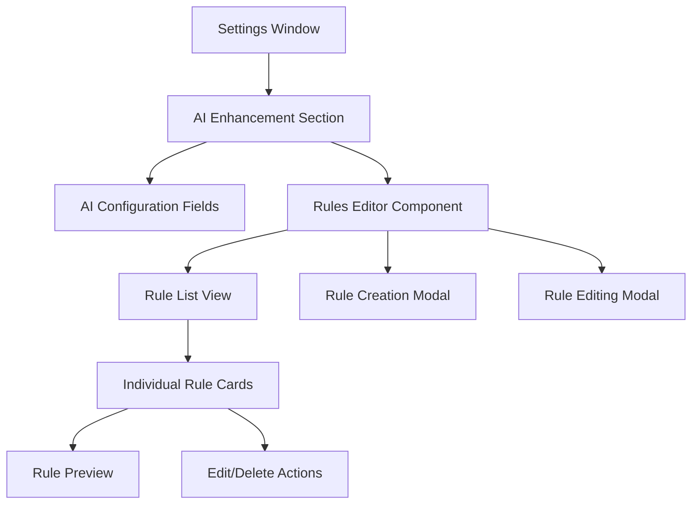

### Settings Schema Integration

The rules editor extends the existing settings schema by introducing a new field type `rules-editor` within the AI enhancement section:

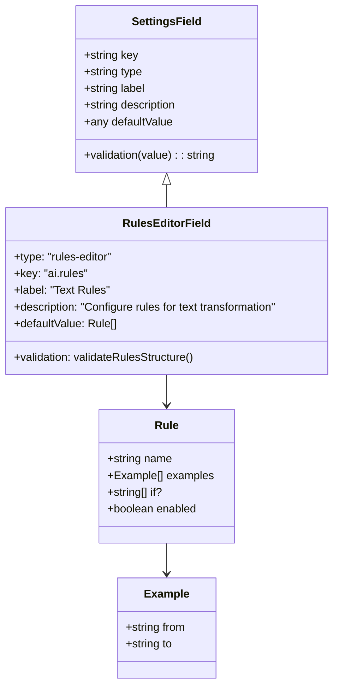

### Icon Updates

Updated section icons following Phosphor Icons duotone design system:

| Section         | Current Icon | New Icon                | Rationale                                   |
| --------------- | ------------ | ----------------------- | ------------------------------------------- |
| Transcription   | `microphone` | `ph:waveform-duotone`   | Better represents audio waveform processing |
| Actions         | `lightning`  | `ph:flow-arrow-duotone` | Emphasizes action flow and automation       |
| Data Management | `database`   | `ph:database-duotone`   | Maintains consistency with duotone theme    |

## Component Architecture

### Rules Editor Component

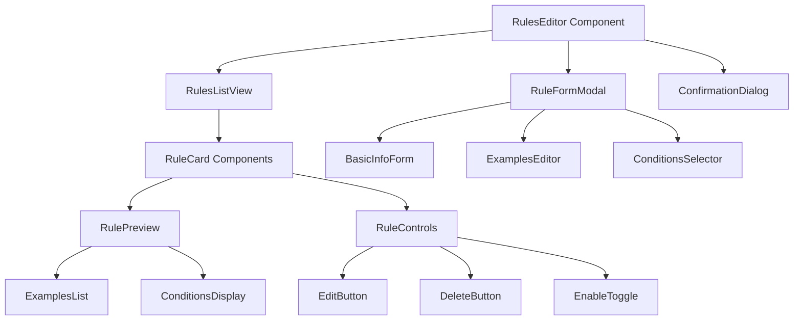

### Rule Data Structure

Keeping the existing rule format from rules.json:

```typescript
interface Rule {
  name: string;
  examples: Example[];
  if?: string[];
}

interface Example {
  from: string;
  to: string;
}
```

### UI Component Hierarchy

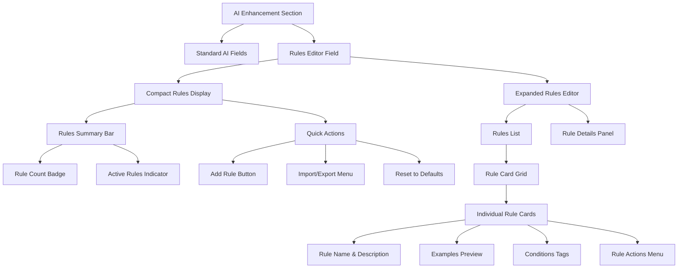

## User Interface Design

### Compact Integration Approach

The rules editor appears as a specialized component within the AI enhancement section, maintaining visual consistency with other setting fields while providing rich functionality:

#### Collapsed State (Default)

- **Rules Summary Bar**: Shows rule count
- **Quick Preview**: Displays first 2-3 rule names
- **Expand Button**: `ph:caret-down-duotone` to reveal full editor
- **Quick Actions**: Add rule (+) button

#### Expanded State

- **Rules List**: Simple single-column list of rule cards
- **Rule Cards**: Basic cards showing rule name and examples count
- **Add Rule Button**: Simple "Add Rule" button at the bottom

### Rule Card Design

Each rule card follows a simple design:

```
┌─────────────────────────────────────┐
│ Remove Filler Words           [Edit]│
│ ─────────────────────────────────── │
│ 📝 3 examples                      │
│ 🏷️ selection, context             │
│ [Delete]                           │
└─────────────────────────────────────┘
```

### Rule Creation/Editing Modal

Simple modal dialog with basic form:

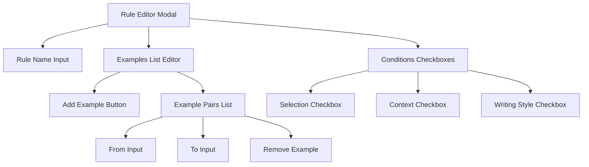

### Simple Layout

- Single-column rule card list
- Full-width modals for editing
- Basic action buttons

## Data Flow Architecture

### Settings Integration Flow

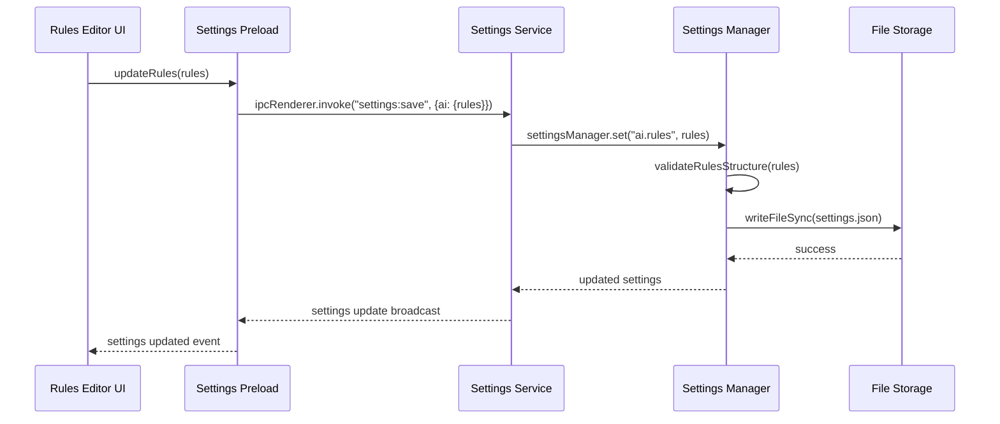

### Rule Processing Pipeline

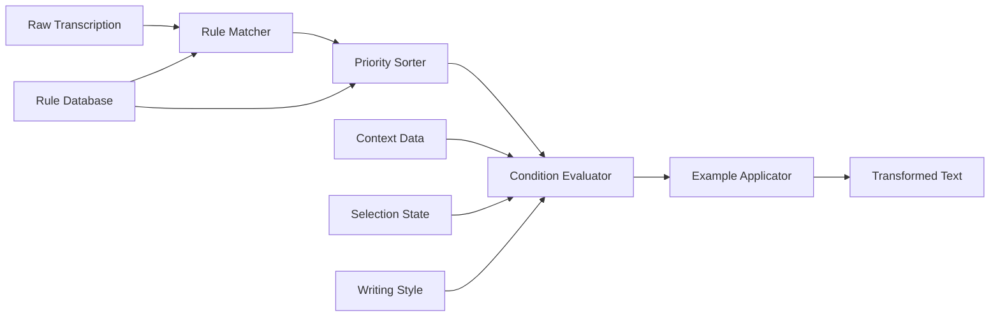

### Simple Validation

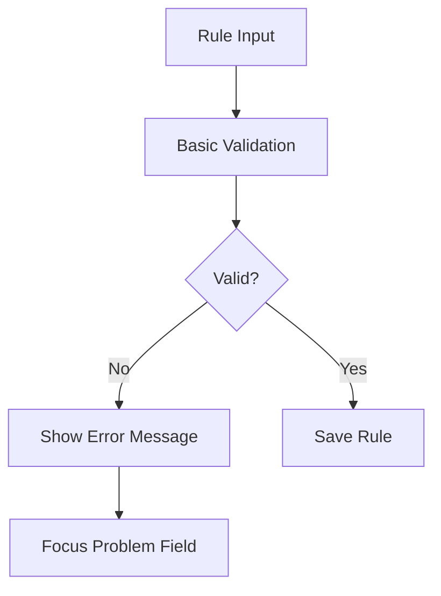

## Technical Implementation

### Component Structure

#### RulesEditor Component

```typescript
interface RulesEditorProps {
  value: Rule[];
  onChange: (rules: Rule[]) => void;
}

interface RulesEditorState {
  expanded: boolean;
  editingRule: Rule | null;
  editingIndex: number | null;
}
```

### Settings Schema Extension

Minimal change to existing SettingsSchema.ts - just change the existing rules field type:

```typescript
// Change existing rules field in ai section
{
  key: "ai.rules",
  type: "rules-editor" as const,
  label: "Text Rules",
  description: "Configure rules for text transformation and processing",
  defaultValue: loadDefaultRules(),
  validation: (value) => {
    // Keep existing validation logic
  }
}
```

### Icon Implementation

```typescript
// Icon mapping updates for settings sections
const SECTION_ICONS = {
  transcription: "ph:waveform-duotone",
  actions: "ph:flow-arrow-duotone",
  data: "ph:database-duotone",
  ai: "flash", // Keep existing for AI enhancement
  // ... other sections
};
```

## State Management

### Simple State Flow

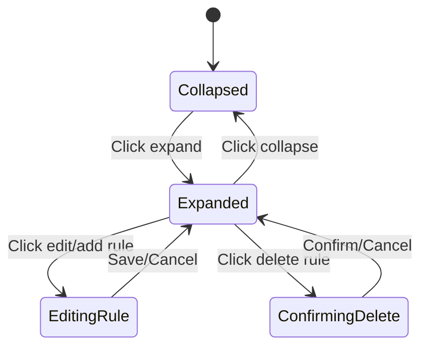

### Simple Data Persistence

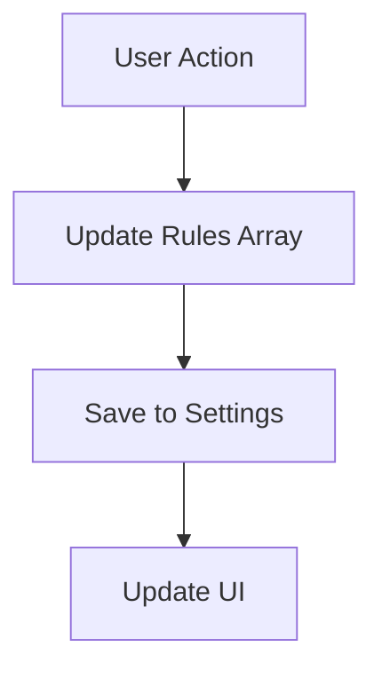

## User Experience Flows

### Simple Rule Creation

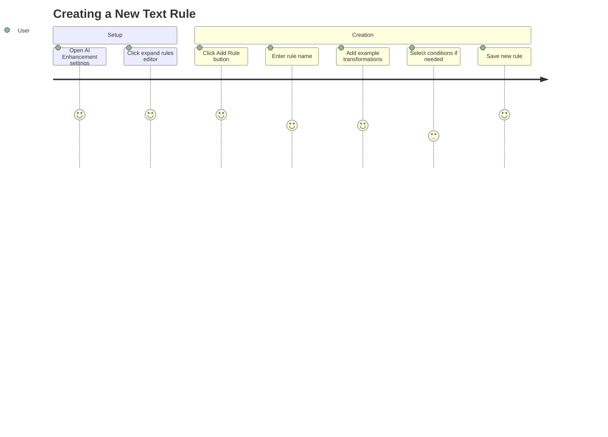

### Simple Rule Management

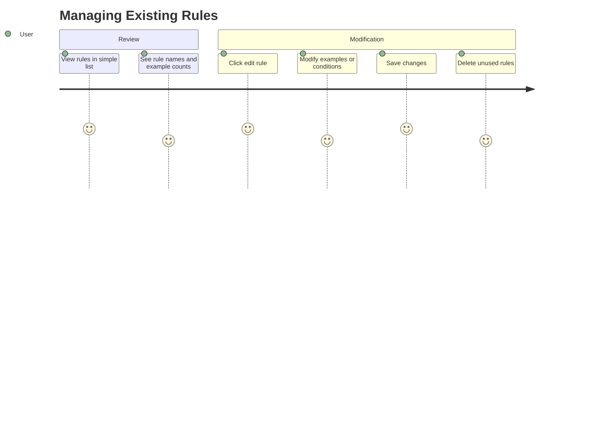

## Testing Strategy

### Basic Testing

#### Rule Creation

- ✅ Create rule with name and examples
- ✅ Validate required fields
- ✅ Save rule with conditions
- ✅ Cancel creation workflow

#### Rule Management

- ✅ Edit existing rule properties
- ✅ Add/remove examples from rule
- ✅ Delete rule with confirmation

#### Integration

- ✅ Persist rules to settings.json
- ✅ Handle basic validation errors

## Error Handling

### Simple Error Handling

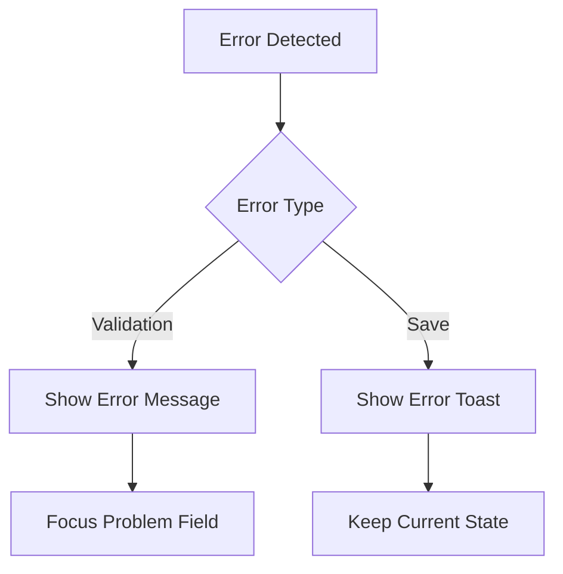

## Migration Strategy

### Backward Compatibility

The rules editor maintains backward compatibility with the existing textarea-based rules configuration:

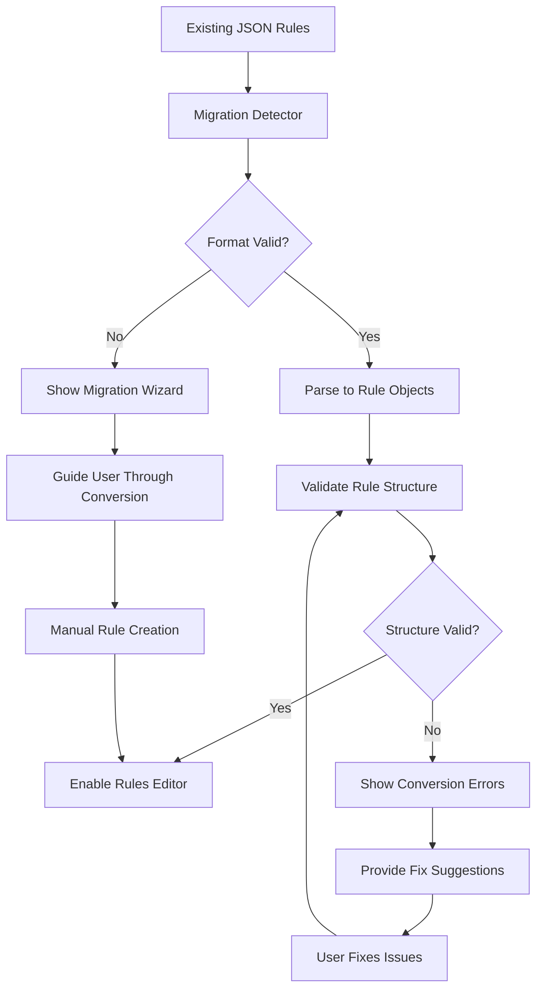

### Keeping Existing Format

The rules editor maintains the existing JSON array format exactly as it is:

```typescript
type Rules = Array<{
  name: string;
  examples: Array<{ from: string; to: string }>;
  if?: string[];
}>;
```

The rules editor design provides a simple, user-friendly interface for managing text transformation rules while maintaining the existing data format and minimizing code changes.
