# Rules Editor Design

## Overview

The rules editor is a compact and user-friendly interface for managing text transformation rules within the AI enhancement settings section. It allows users to create, edit, and manage custom rules that control how the AI processes and transforms transcribed text, providing a streamlined alternative to manual JSON editing.

## Repository Type

Desktop Application - Electron-based macOS dictation application with TypeScript backend and HTML/JavaScript frontend.

## Architecture

### Component Integration

The rules editor integrates seamlessly into the existing settings architecture without creating a separate section, appearing as a specialized field type within the AI enhancement section.

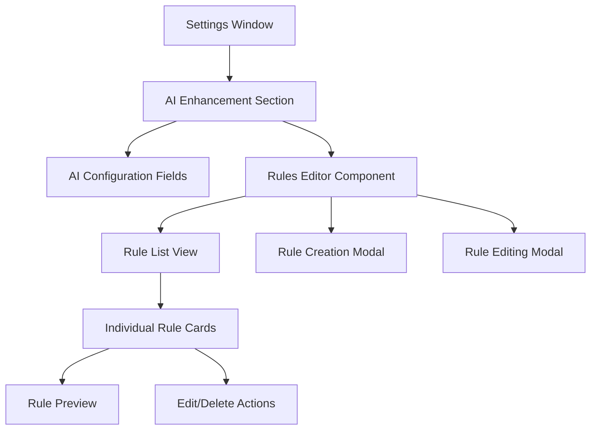

### Settings Schema Integration

The rules editor extends the existing settings schema by introducing a new field type `rules-editor` within the AI enhancement section:

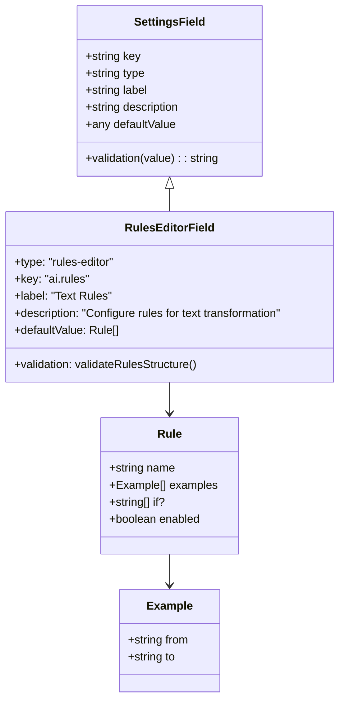

### Icon Updates

Updated section icons following Phosphor Icons duotone design system:

| Section | Current Icon | New Icon | Rationale |
|---------|-------------|----------|-----------|
| Transcription | `microphone` | `ph:waveform-duotone` | Better represents audio waveform processing |
| Actions | `lightning` | `ph:flow-arrow-duotone` | Emphasizes action flow and automation |
| Data Management | `database` | `ph:database-duotone` | Maintains consistency with duotone theme |

## Component Architecture

### Rules Editor Component

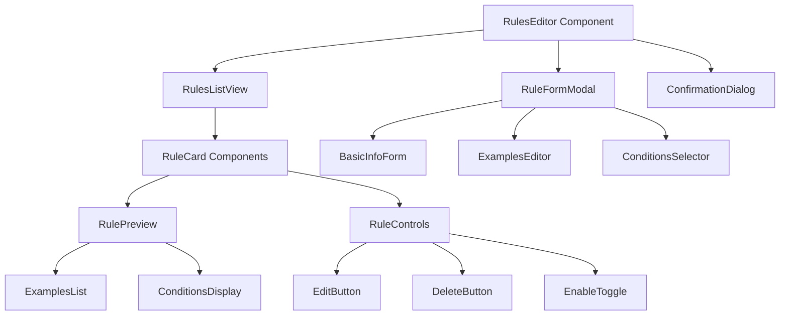

### Rule Data Structure

```typescript
interface Rule {
  id: string;
  name: string;
  description?: string;
  examples: Example[];
  if?: RuleCondition[];
  enabled: boolean;
  priority: number;
}

interface Example {
  from: string;
  to: string;
  description?: string;
}

type RuleCondition = 'selection' | 'context' | 'writing_style';
```

### UI Component Hierarchy

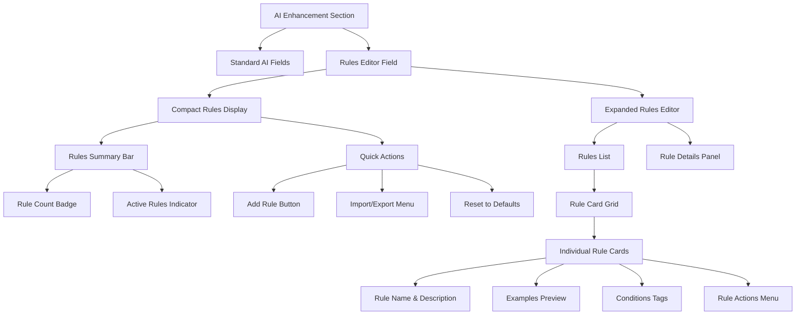

## User Interface Design

### Compact Integration Approach

The rules editor appears as a specialized component within the AI enhancement section, maintaining visual consistency with other setting fields while providing rich functionality:

#### Collapsed State (Default)
- **Rules Summary Bar**: Shows rule count, active rules indicator
- **Quick Preview**: Displays first 2-3 rule names
- **Expand Button**: `ph:caret-down-duotone` to reveal full editor
- **Quick Actions**: Add rule (+), import/export menu (⋯)

#### Expanded State
- **Rules Grid**: 2-column responsive layout of rule cards
- **Rule Cards**: Compact cards showing rule name, examples count, conditions
- **Floating Action Button**: Persistent "Add Rule" button
- **Filter/Search Bar**: Quick filtering by name or condition type

### Rule Card Design

Each rule card follows a compact, scannable design:

```
┌─────────────────────────────────────┐
│ ⚡ Remove Filler Words        [⋯]  │
│ ─────────────────────────────────── │
│ 📝 3 examples • Context aware      │
│ ├ "uh, um" → ""                    │
│ ├ "[coughing]" → ""                │
│ └ "I think, maybe" → "I think"     │
│ ─────────────────────────────────── │
│ 🏷️ selection, context             │
│ [○ Enabled] [Edit] [Delete]        │
└─────────────────────────────────────┘
```

### Rule Creation/Editing Modal

Modal dialog with tabbed interface for complex rule configuration:

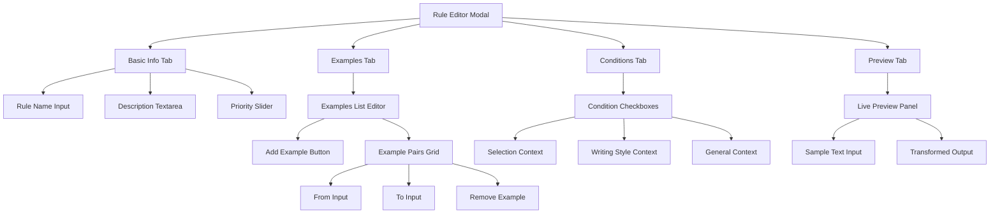

### Responsive Design Patterns

#### Desktop Layout (>768px)
- 2-column rule card grid
- Side-by-side modal layout for editing
- Expanded quick actions toolbar

#### Compact Layout (≤768px)
- Single-column rule card stack
- Full-width modals with collapsible sections
- Simplified quick actions menu

## Data Flow Architecture

### Settings Integration Flow

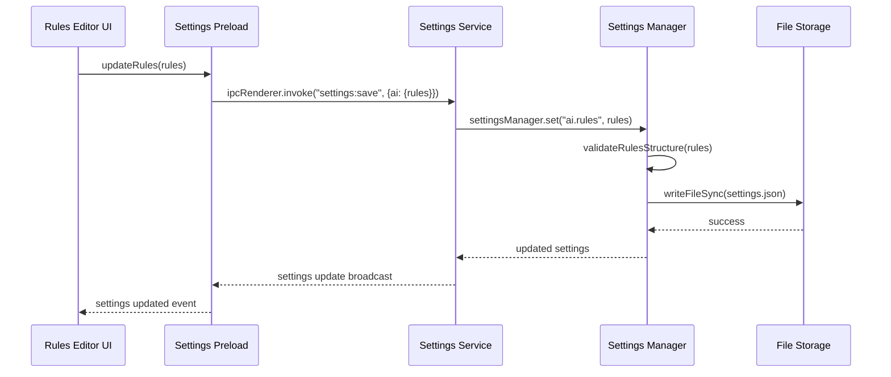

### Rule Processing Pipeline

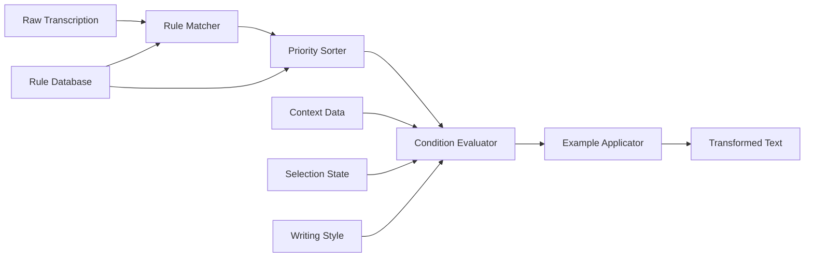

### Validation and Error Handling

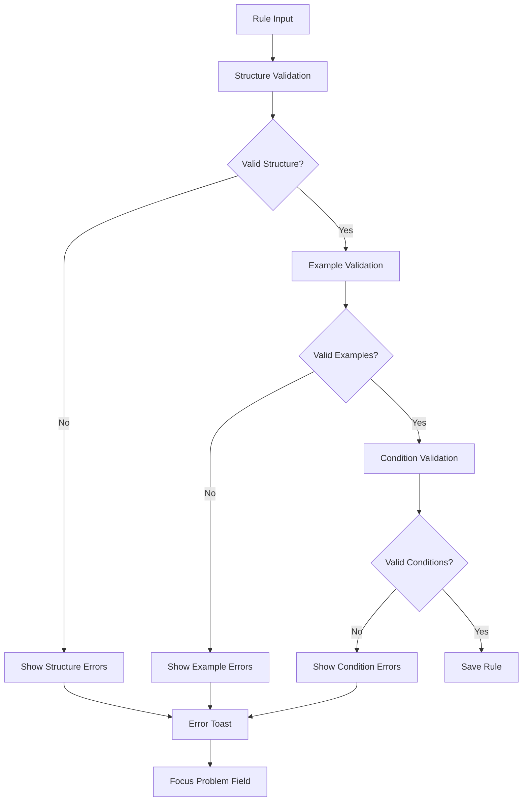

## Technical Implementation

### Component Structure

#### RulesEditor Component
```typescript
interface RulesEditorProps {
  value: Rule[];
  onChange: (rules: Rule[]) => void;
  compact?: boolean;
  maxRules?: number;
}

interface RulesEditorState {
  expanded: boolean;
  selectedRule: Rule | null;
  editingRule: Rule | null;
  filter: string;
  showImportDialog: boolean;
}
```

#### Rule Validation System
```typescript
interface RuleValidationResult {
  valid: boolean;
  errors: {
    field: string;
    message: string;
  }[];
  warnings: {
    field: string;
    message: string;
  }[];
}

interface RuleValidator {
  validateStructure(rule: Rule): RuleValidationResult;
  validateExamples(examples: Example[]): RuleValidationResult;
  validateConditions(conditions: RuleCondition[]): RuleValidationResult;
  validateUniqueness(rule: Rule, existingRules: Rule[]): RuleValidationResult;
}
```

### Settings Schema Extension

```typescript
// Extension to existing SettingsSchema.ts
{
  key: "ai.rules",
  type: "rules-editor" as const,
  label: "Text Rules",
  description: "Configure rules for text transformation and processing",
  defaultValue: loadDefaultRules(),
  validation: (value: Rule[]) => {
    const validator = new RuleValidator();
    const results = value.map(rule => validator.validateStructure(rule));
    const errors = results.flatMap(r => r.errors);
    return errors.length > 0 ? errors.map(e => e.message).join(", ") : null;
  }
}
```

### Icon Implementation

```typescript
// Icon mapping updates for settings sections
const SECTION_ICONS = {
  transcription: "ph:waveform-duotone",
  actions: "ph:flow-arrow-duotone", 
  data: "ph:database-duotone",
  ai: "flash", // Keep existing for AI enhancement
  // ... other sections
};
```

## State Management

### Rule State Flow

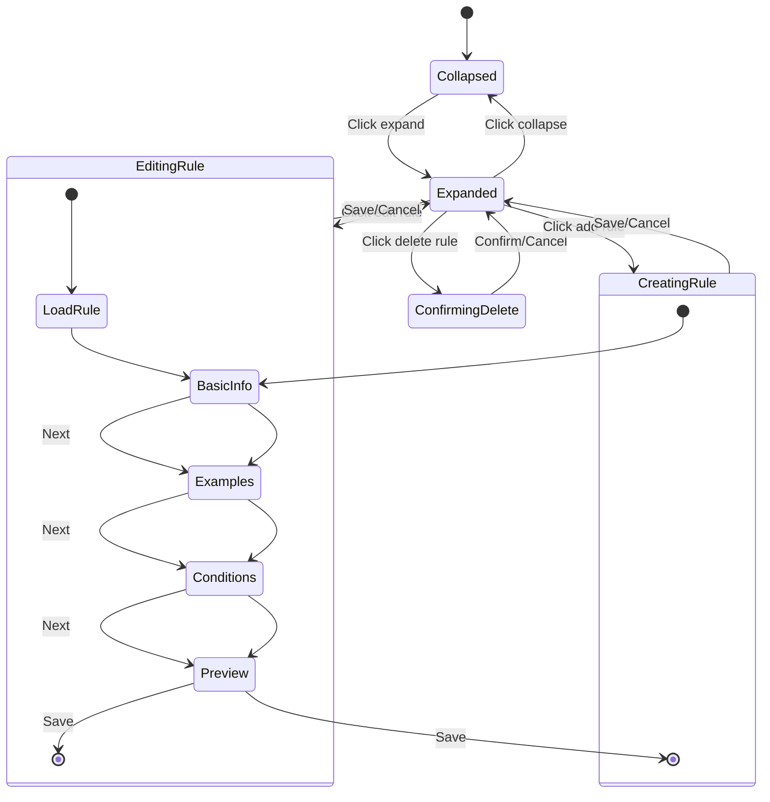

### Data Persistence Strategy

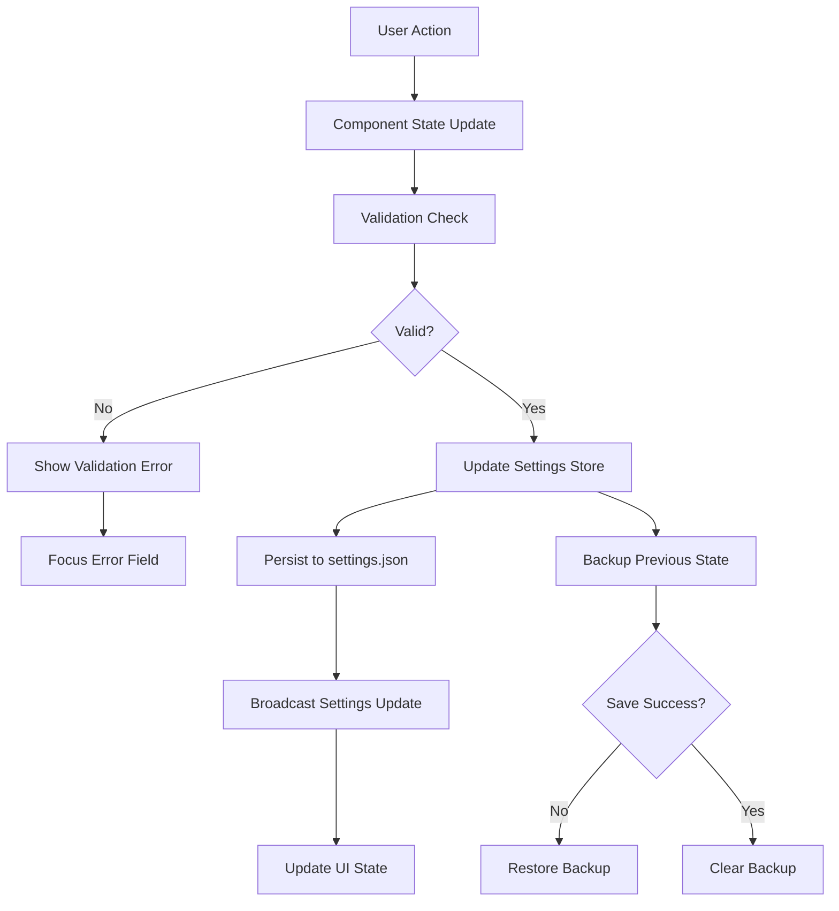

## User Experience Flows

### Rule Creation Workflow

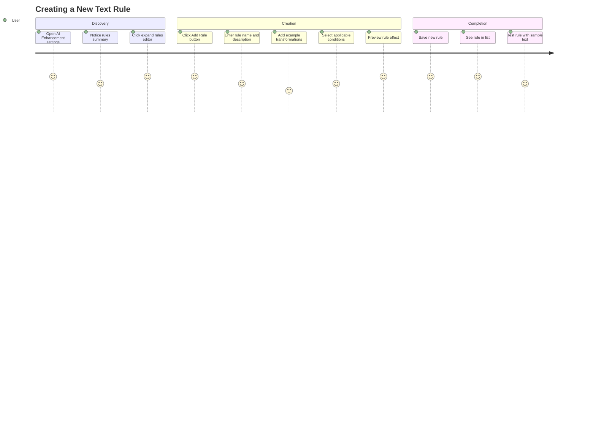

### Rule Management Workflow

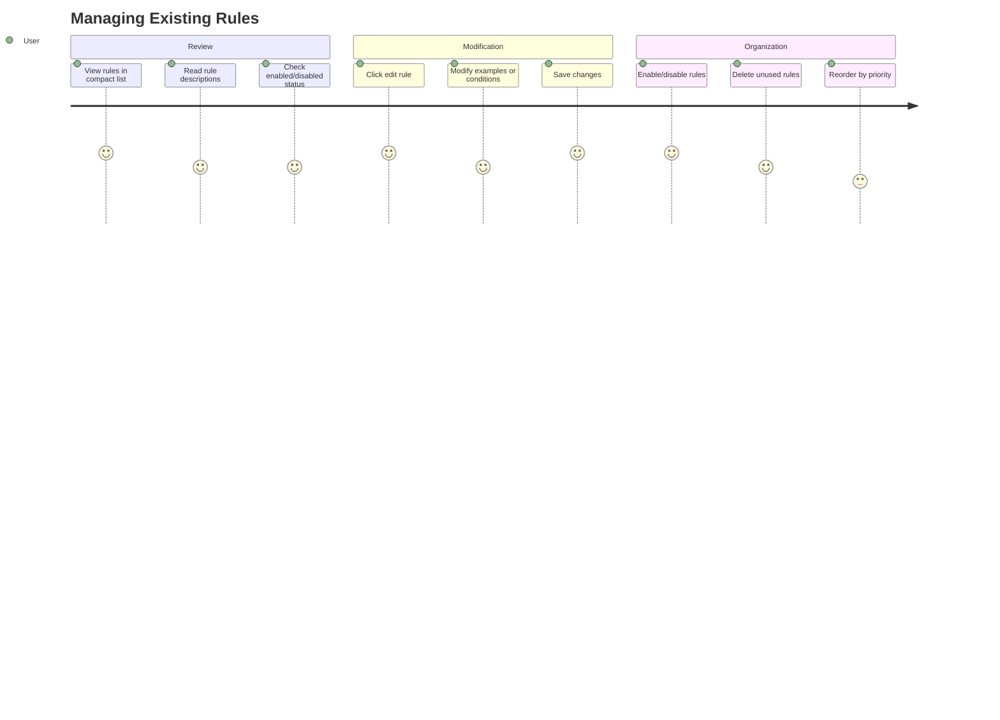

## Testing Strategy

### Component Testing

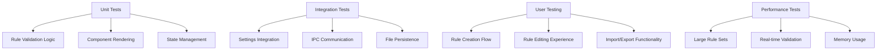

### Test Scenarios

#### Rule Creation
- ✅ Create rule with valid name and examples
- ✅ Validate required fields
- ❌ Prevent duplicate rule names
- ❌ Handle invalid example formats
- ✅ Save rule with conditions
- ✅ Cancel creation workflow

#### Rule Management
- ✅ Edit existing rule properties
- ✅ Add/remove examples from rule
- ✅ Toggle rule enabled state
- ✅ Delete rule with confirmation
- ✅ Bulk enable/disable operations
- ✅ Import/export rule sets

#### Integration
- ✅ Persist rules to settings.json
- ✅ Sync with AI transformation pipeline
- ✅ Handle settings validation errors
- ✅ Restore from backup on failure
- ✅ Update UI on external settings changes

## Performance Considerations

### Optimization Strategies

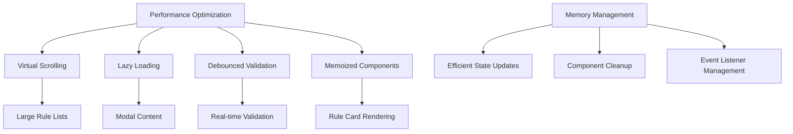

### Scalability Limits

| Aspect | Recommended Limit | Performance Impact |
|--------|------------------|-------------------|
| Total Rules | 50-100 | Minimal |
| Examples per Rule | 10-20 | Low |
| Rule Name Length | 100 characters | None |
| Example Text Length | 500 characters | Low |
| Concurrent Editors | 1 | None |

## Error Handling

### Error Classification

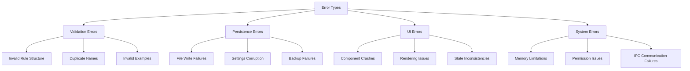

### Recovery Mechanisms

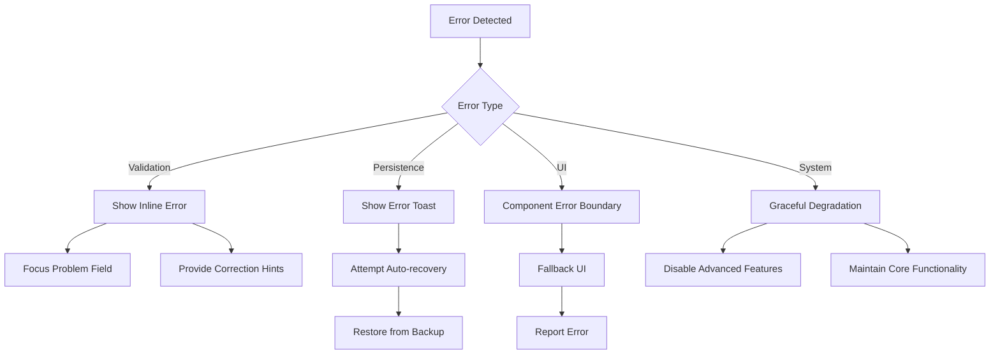

## Migration Strategy

### Backward Compatibility

The rules editor maintains backward compatibility with the existing textarea-based rules configuration:

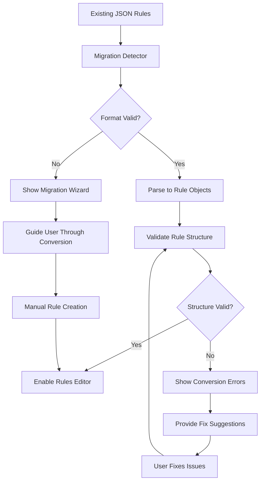

### Data Format Evolution

```typescript
// Version 1: Current JSON array format
type RulesV1 = Array<{
  name: string;
  examples: Array<{from: string; to: string}>;
  if?: string[];
}>;

// Version 2: Enhanced rule objects with metadata
type RulesV2 = Array<{
  id: string;
  name: string;
  description?: string;
  examples: Array<{from: string; to: string; description?: string}>;
  if?: RuleCondition[];
  enabled: boolean;
  priority: number;
  version: 2;
}>;
```

The rules editor design provides a compact, user-friendly interface for managing text transformation rules while maintaining seamless integration with the existing AI enhancement settings. The design prioritizes discoverability, ease of use, and powerful functionality without overwhelming the user interface.