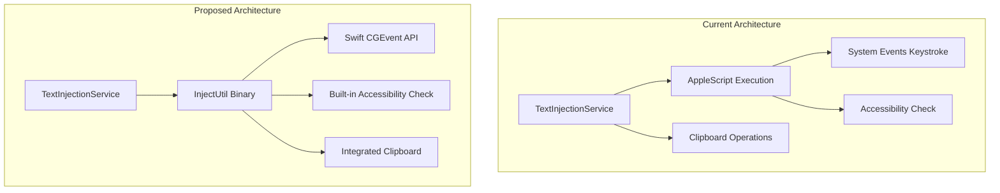
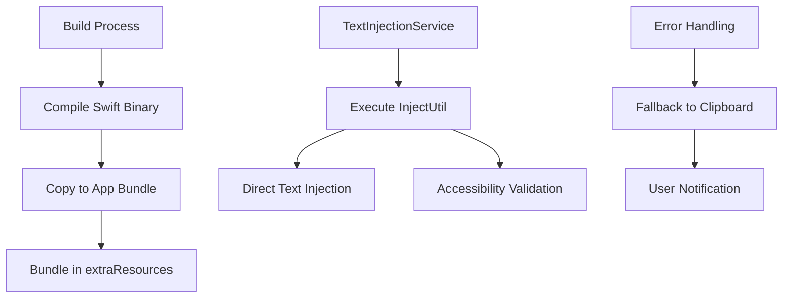
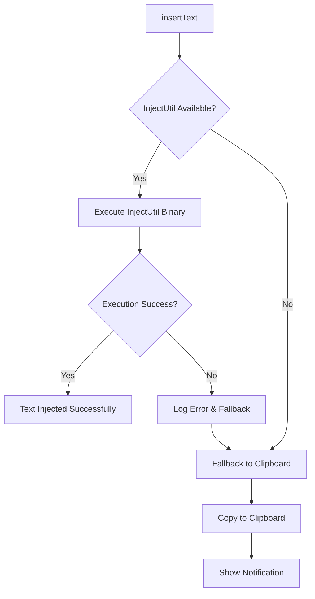

# Text Injection Refactor: Swift InjectUtil Integration

## Overview

This design outlines the refactoring of WhisperMac's text injection system from AppleScript-based implementation to a Swift utility (`injectUtil`) approach. The current `TextInjectionService.ts` uses AppleScript for keystroke simulation, which has performance and reliability limitations. The refactor will integrate the existing Swift `injectUtil` binary into the application bundle and modify the service to use this more efficient approach.

## Architecture

### Current vs Proposed Architecture

### Component Integration

## Implementation Details

### Build Process Integration

#### Swift Binary Compilation
- Compile `injectUtil.swift` during the application build process
- Generate optimized binary for macOS (Intel and Apple Silicon)
- Include binary in Electron's `extraResources` configuration

#### Build Script Modifications
- Extend `copy-assets.js` to compile Swift utility
- Add compilation step to main build script
- Ensure binary permissions are correctly set

### TextInjectionService Refactor

#### Core Method Restructure

#### Binary Execution Strategy
- Use Node.js `child_process.execFile` for binary execution
- Pass text as command-line argument to `injectUtil`
- Handle binary output and error codes
- Implement timeout mechanisms for binary execution

#### Error Handling and Fallback
- Primary: Swift binary execution
- Secondary: Clipboard copy with user notification
- Tertiary: Error logging and user feedback

### Configuration Management

#### Binary Path Resolution
- Determine binary location within app bundle
- Handle development vs production environments
- Validate binary existence and permissions

#### Accessibility Permission Handling
- Leverage `injectUtil`'s built-in accessibility checks
- Remove redundant AppleScript-based permission validation
- Streamline permission request workflow

## Security Considerations

### Binary Validation
- Verify binary integrity during build process
- Ensure proper code signing for macOS distribution
- Validate binary permissions at runtime

### Accessibility Permissions
- Maintain existing accessibility permission workflow
- Provide clear user guidance for permission setup
- Handle permission changes gracefully

## Performance Optimization

### Execution Efficiency
- Swift binary provides faster execution than AppleScript
- Reduced overhead from osascript process spawning
- More reliable keystroke simulation

### Resource Management
- Efficient binary execution with proper cleanup
- Minimal memory footprint for text injection operations
- Reduced dependency on system AppleScript framework

## Testing Strategy

### Unit Testing
- Mock binary execution for isolated testing
- Test fallback mechanisms independently
- Validate error handling paths

### Integration Testing
- Test binary compilation and bundling
- Verify accessibility permission integration
- Validate text injection across different applications

### Platform Testing
- Test on Intel and Apple Silicon Macs
- Verify compatibility across macOS versions
- Test with various target applications

## Migration Strategy

### Development Phase
1. Implement binary compilation in build process
2. Refactor TextInjectionService core methods
3. Add comprehensive error handling and fallback
4. Integrate accessibility permission workflow

### Testing Phase
1. Unit test new implementation components
2. Integration test with existing application flow
3. Performance benchmark against current implementation
4. User acceptance testing for accessibility workflow

### Deployment Phase
1. Update build configuration for binary inclusion
2. Deploy with fallback to current implementation
3. Monitor performance and error metrics
4. Complete migration after validation

## Error Scenarios and Handling

### Binary Execution Failures
- Missing binary file
- Insufficient permissions
- Binary execution timeout
- Invalid command-line arguments

### Accessibility Issues
- Permissions not granted
- Permissions revoked during execution
- System accessibility service unavailable

### Fallback Mechanisms
- Automatic fallback to clipboard operations
- User notification for manual paste required
- Error logging for debugging and monitoring