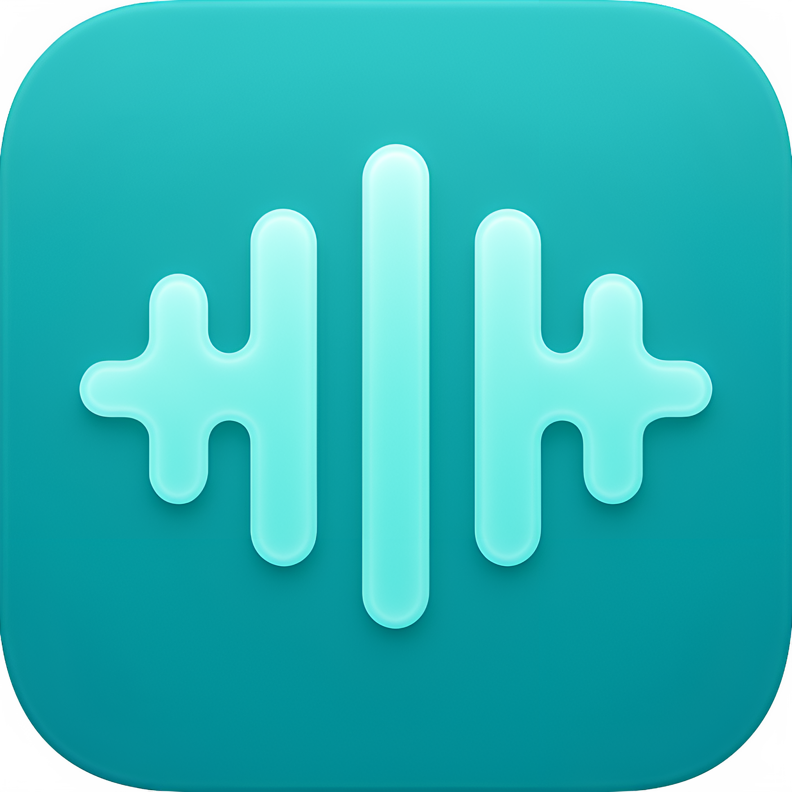

<h1>WhisperMac</h1>

Local first, extensible, privacy friendly and fast dictation app for macOS. It supports Parakeet, WhisperCPP, Vosk, mac's native Speech framework (all local) or cloud services like Gemini, or Mistral for transcription. It also has support for custom transcription + transformation rules, and lots of settings!

## Some features:
- Real time transcription using [Silero VAD](https://www.vad.ricky0123.com/) to chunk audio
- Extensible with plugins. See plugins like [the whisper plugin](src/plugins/WhisperCppTranscriptionPlugin.ts)
- WhisperCpp with apple metal CoreML support (the fastest implementation I could find for apple's MPS)
- Support for Nvidia's Parakeet STT engine, the fastest and most accurate currently
- (Optional) enhancement of transcribed text via an OpenAI compatible service (using Cerebras as the default)
- Configurable actions (Say "Open Safari" or "Open hackernews")
- Unified model management and controllable data storage: You have full control
- Recording history

## Installation
I will build it and upload it once I have things ironed out but for now clone the repo, run `bun run prep` (to download and setup whisper binaries, needs to be done on a apple silicon mac for support for whisper-cli-metal) and then `bun run build`.

> **Shameless Plug**: You can install this really easily using my tool [`justinstall`](https://github.com/explosion-scratch/justinstall) which aims to easily install most types of tool
